# 11장 응용 SW 기초 기술 활용 — 다이어그램 학습

---

## 전체 구조 마인드맵

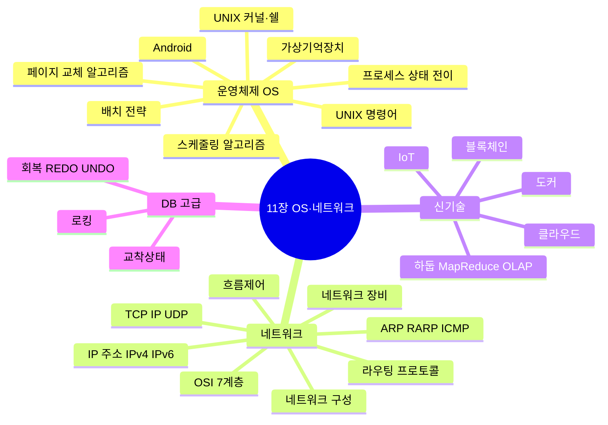

---

## 운영체제 종류 ★A

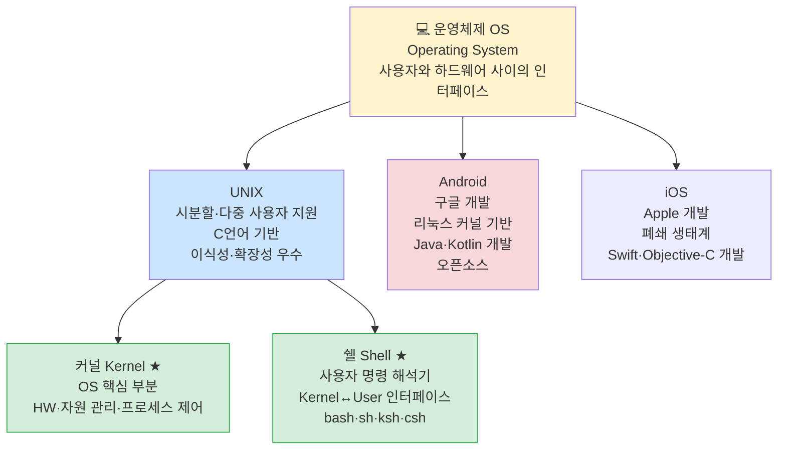

---

## 배치 전략 ★B

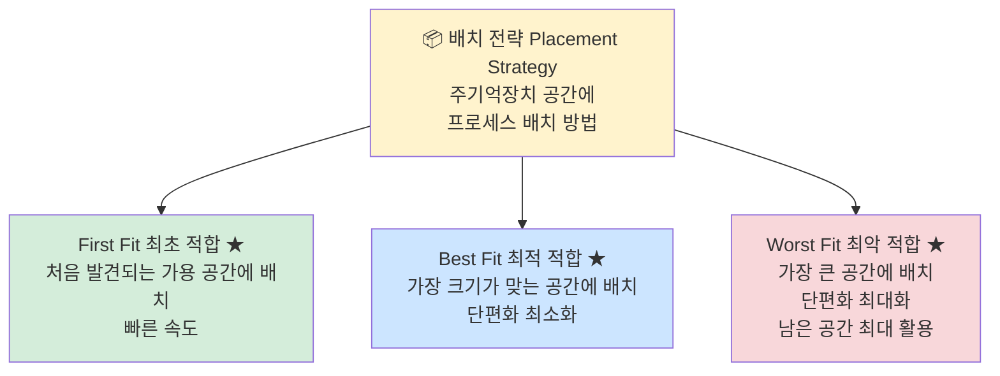

---

## 페이지 교체 알고리즘 ★A

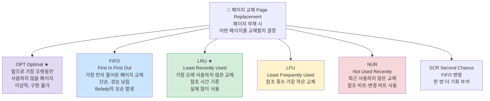

---

## 프로세스 상태 전이 ★A

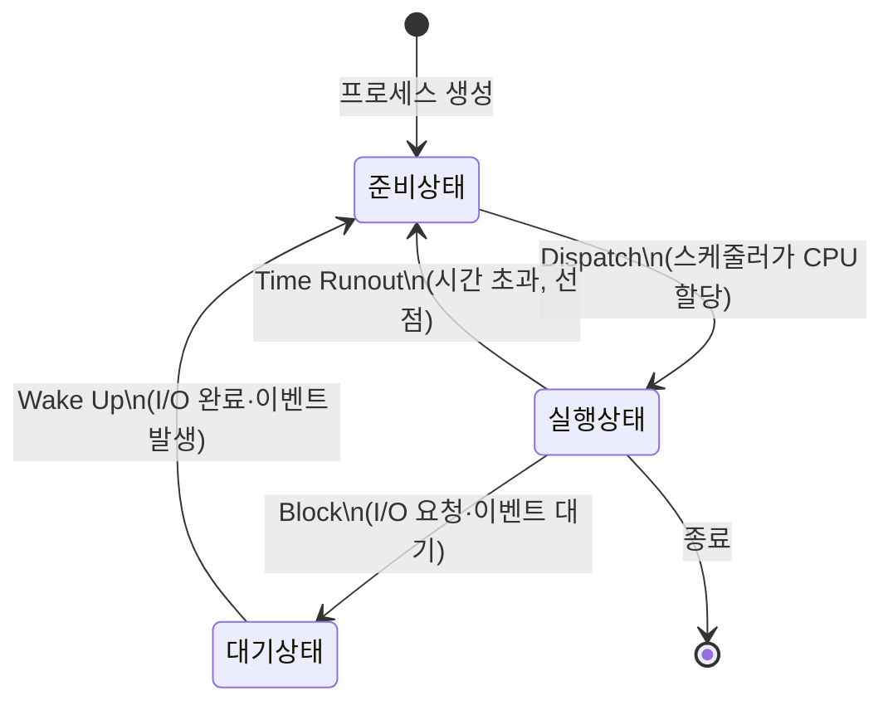

> - **Dispatch**: 준비 → 실행 (CPU 할당)
> - **Wake Up**: 대기 → 준비 (I/O 완료)
> - **Spooling**: 입출력과 CPU 처리를 중간 버퍼(스풀)로 병행 처리

---

## 스케줄링 알고리즘 ★A

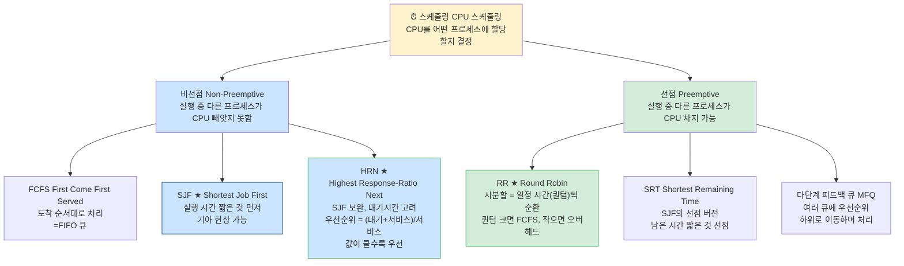

> **HRN 우선순위 공식**: (대기시간 + 서비스시간) / 서비스시간

---

## UNIX 주요 명령어 ★A

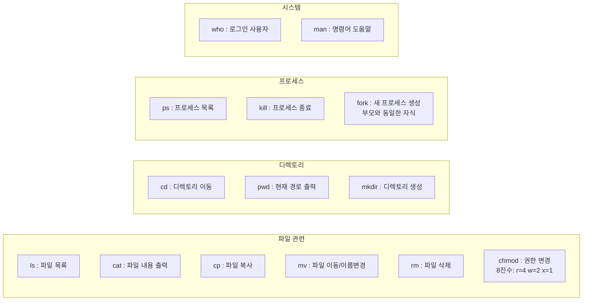

> **chmod 예시**: `chmod 755 파일명`
> → 소유자(7=rwx) / 그룹(5=r-x) / 기타(5=r-x)

---

## OSI 7계층 ★A

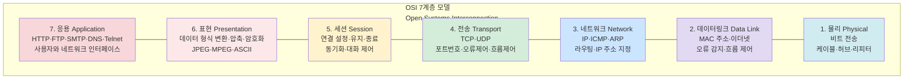

> 암기법: **물데네전세표응** (1층부터 7층)

---

## 네트워크 장비 ★A

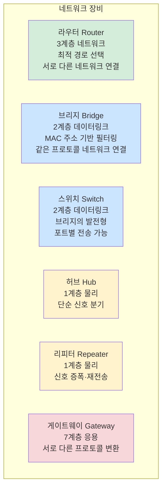

---

## TCP/IP 프로토콜 ★A

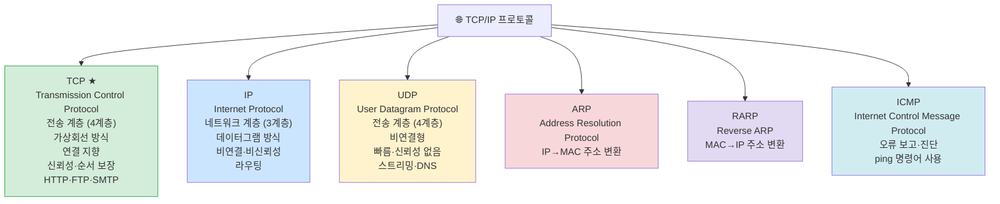

---

## IP 주소 ★A

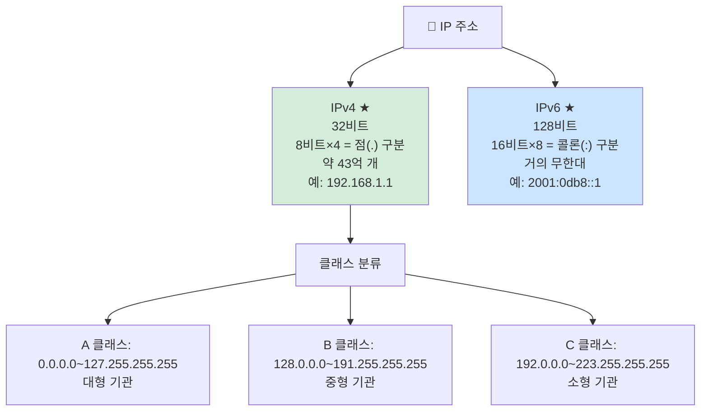

---

## 프로토콜 기본 요소 + 패킷 교환 방식 ★A

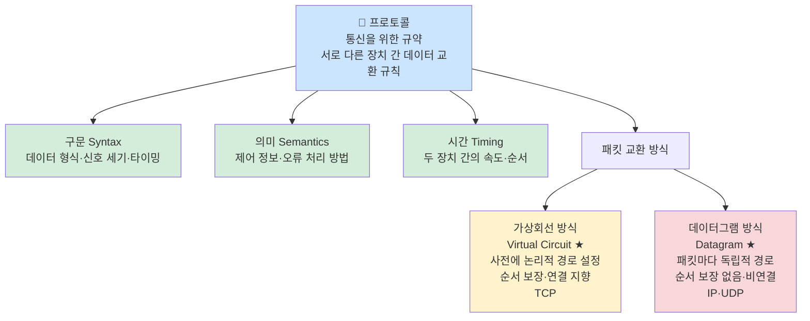

---

## L2TP / ICMP / NAT ★A

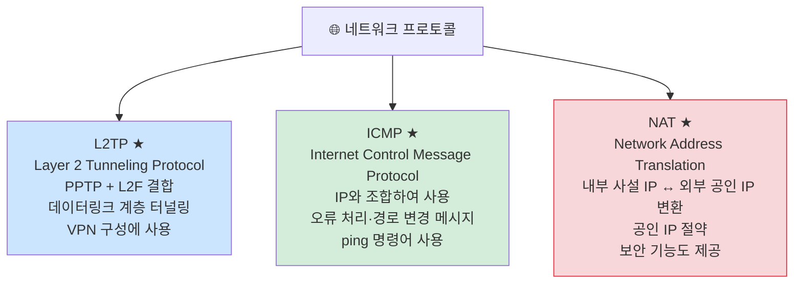

---

## RAID ★A

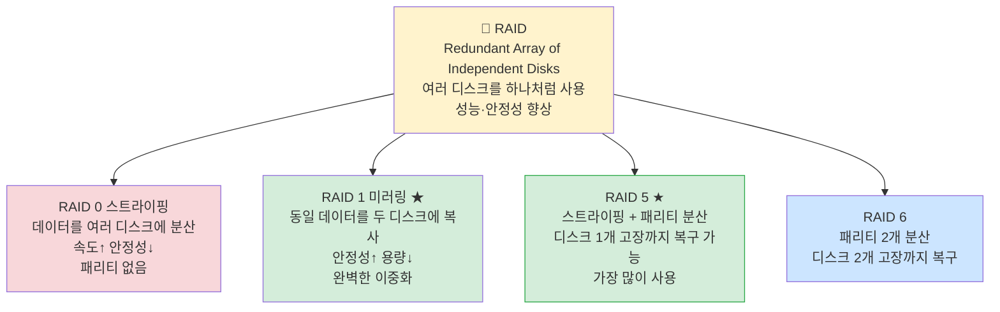

---

## SW / HW 관련 신기술 ★A

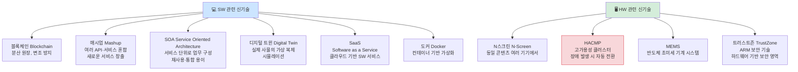

---

## 즉각 갱신 기법 / 로킹 ★A

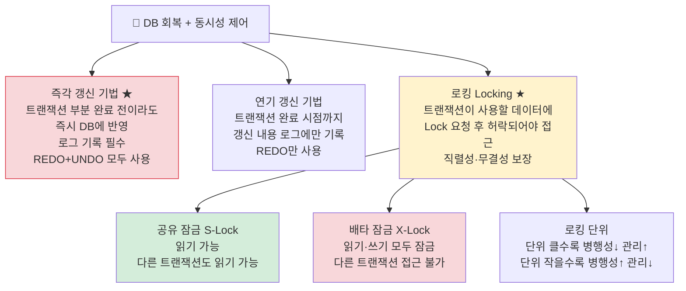

---

## 교착상태(Deadlock) ★A

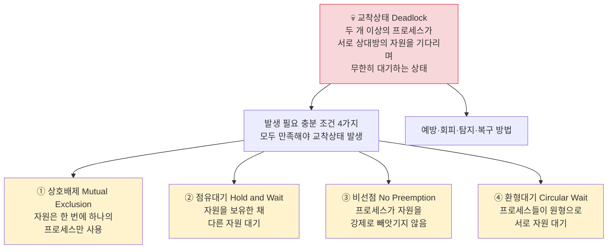

---

## 라우팅 프로토콜 ★B

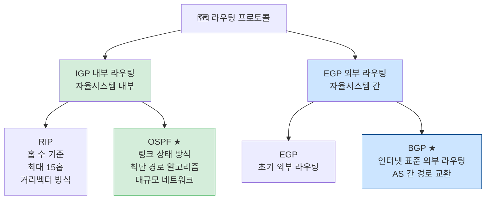

---

## DB 회복 기법 ★B

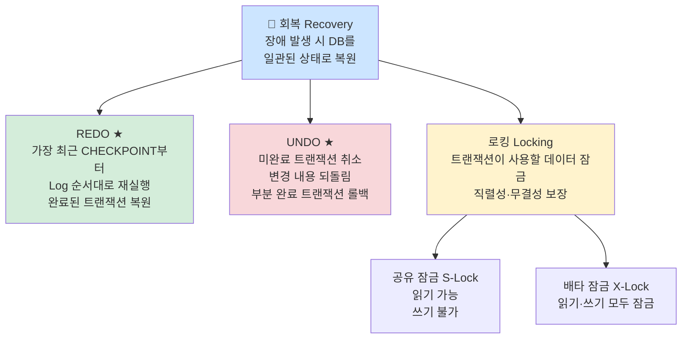

---

## 신기술 키워드 ★B

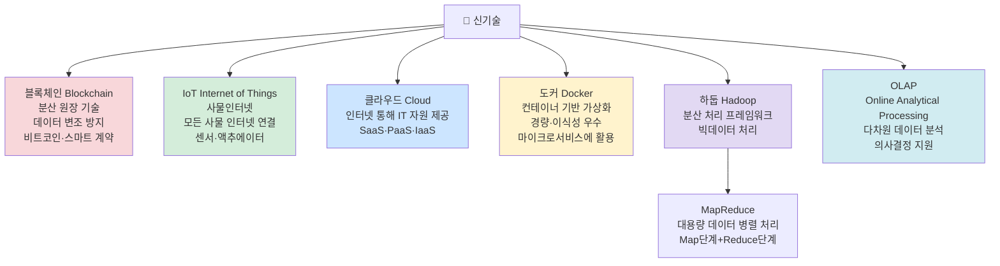

---

## 핵심 암기 요약표

| 번호 | 항목 | 핵심 키워드 | 난이도 |
|------|------|-------------|--------|
| 236 | UNIX 커널 | OS 핵심, HW 자원 관리 | **A** |
| 236 | UNIX 쉘 | 명령 해석기, Kernel↔User 인터페이스 | **A** |
| 238 | Android | 구글 개발, 리눅스 커널 기반, 오픈소스 | **A** |
| 239 | First Fit | 처음 발견 공간 배치, 빠름 | **B** |
| 239 | Best Fit | 가장 맞는 공간, 단편화 최소 | **B** |
| 239 | Worst Fit | 가장 큰 공간, 단편화 최대 | **B** |
| 243 | LRU 페이지 교체 | 가장 오래 사용 안 한 것 교체 | **A** |
| 244 | LFU 페이지 교체 | 참조 횟수 가장 적은 것 교체 | **A** |
| 242 | FIFO 페이지 교체 | 가장 먼저 들어온 것 교체 | **B** |
| 248 | Dispatch | 준비→실행 (CPU 할당) | **A** |
| 248 | Wake Up | 대기→준비 (I/O 완료) | **A** |
| 251 | SJF | 실행시간 짧은 프로세스 먼저, 최적 | **A** |
| 252 | HRN 공식 | (대기+서비스)/서비스, 클수록 우선 | **A** |
| 253 | RR 스케줄링 | 시분할, 퀀텀 크면 FCFS | **A** |
| 254 | SRT | 남은 시간 가장 짧은 것 선점 | **A** |
| 256 | UNIX 명령어 | ls·cat·cp·mv·rm·chmod·ps·kill·fork | **A** |
| 257 | chmod 8진수 | r=4, w=2, x=1 / 755=rwxr-xr-x | **A** |
| 258 | IPv4 vs IPv6 | 32비트(4옥텟) vs 128비트(8그룹) | **A** |
| 260 | 서브네팅 | FLSM 방식, 서브넷 마스크 | **A** |
| 261 | OSI 7계층 | 물데네전세표응 | **A** |
| 262 | 라우터 | 3계층, 최적 경로 선택 | **B** |
| 262 | 게이트웨이 | 7계층, 프로토콜 변환 | **B** |
| 263 | 프로토콜 기본 요소 | 구문·의미·시간 | **A** |
| 265 | 가상회선 vs 데이터그램 | 가상회선=순서보장, 데이터그램=독립경로 | **A** |
| 266 | TCP vs UDP | TCP=연결형신뢰 / UDP=비연결비신뢰빠름 | **A** |
| 268 | L2TP | PPTP+L2F, 데이터링크계층 터널링 | **A** |
| 269 | ICMP | IP+조합, 오류처리·ping | **A** |
| 270 | ARP vs RARP | ARP:IP→MAC / RARP:MAC→IP | **A** |
| 271 | 네트워크 신기술 | 메시·피코넷·Ad-hoc·WDM·SDDC·IoT·클라우드 | **A** |
| 275 | NAT | 사설IP↔공인IP 변환, IP절약 | **A** |
| 276 | RIP | 홉 수 기준, 최대 15홉, Bellman-Ford | **A** |
| 276 | OSPF | 링크상태, Dijkstra, 대규모 | **A** |
| 277 | BGP | AS 간 라우팅, 인터넷 표준 | **A** |
| 279 | SW 신기술 | 블록체인·매시업·SOA·디지털트윈·SaaS·도커 | **A** |
| 280 | HW 신기술 | N스크린·HACMP·MEMS·트러스트존 | **A** |
| 281 | RAID 0 | 스트라이핑, 속도↑ 안정성↓ | **A** |
| 281 | RAID 1 | 미러링, 안정성↑ 용량↓ | **A** |
| 281 | RAID 5 | 스트라이핑+패리티분산, 1개 고장 복구 | **A** |
| 283 | 하둡/MapReduce | 빅데이터 분산 처리 | **A** |
| 283 | OLAP | 다차원 데이터 분석, 의사결정 지원 | **A** |
| 284 | REDO vs UNDO | REDO=완료재실행 / UNDO=미완료취소 | **A** |
| 286 | 즉각 갱신 기법 | 부분완료 전이라도 즉시 DB 반영 | **A** |
| 287 | 로킹 | Lock 요청 후 허락되어야 접근, 직렬성 보장 | **A** |
| 290 | 교착상태 4조건 | 상호배제·점유대기·비선점·환형대기 | **B** |
| 291 | 교착상태 해결 | 예방·회피(은행원알고리즘)·발견·회복 | **B** |

---

*11장 응용 SW 기초 기술 활용 (실기_이론(2) p.1 기반)*
