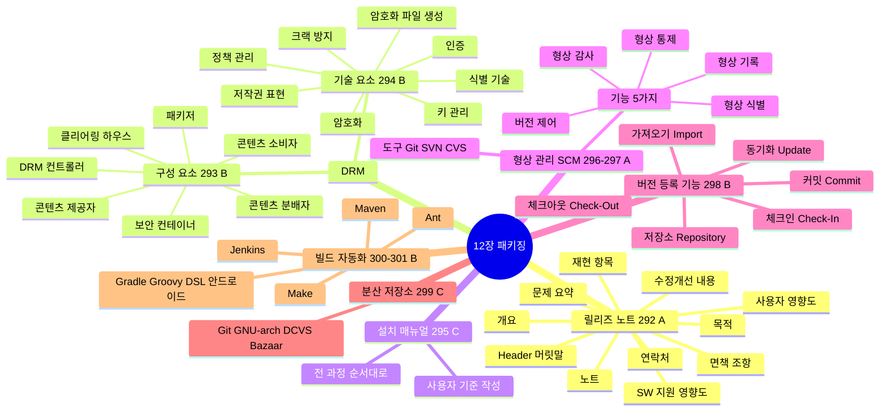
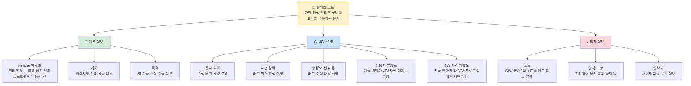
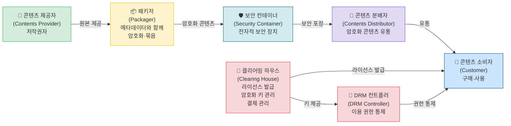
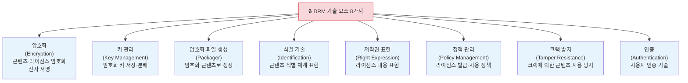
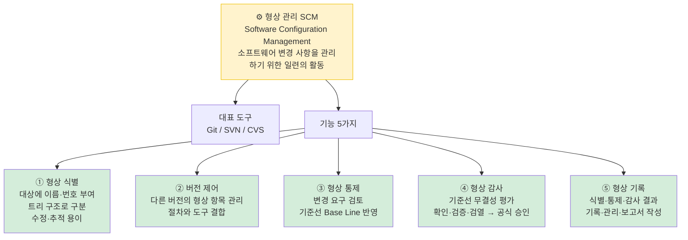
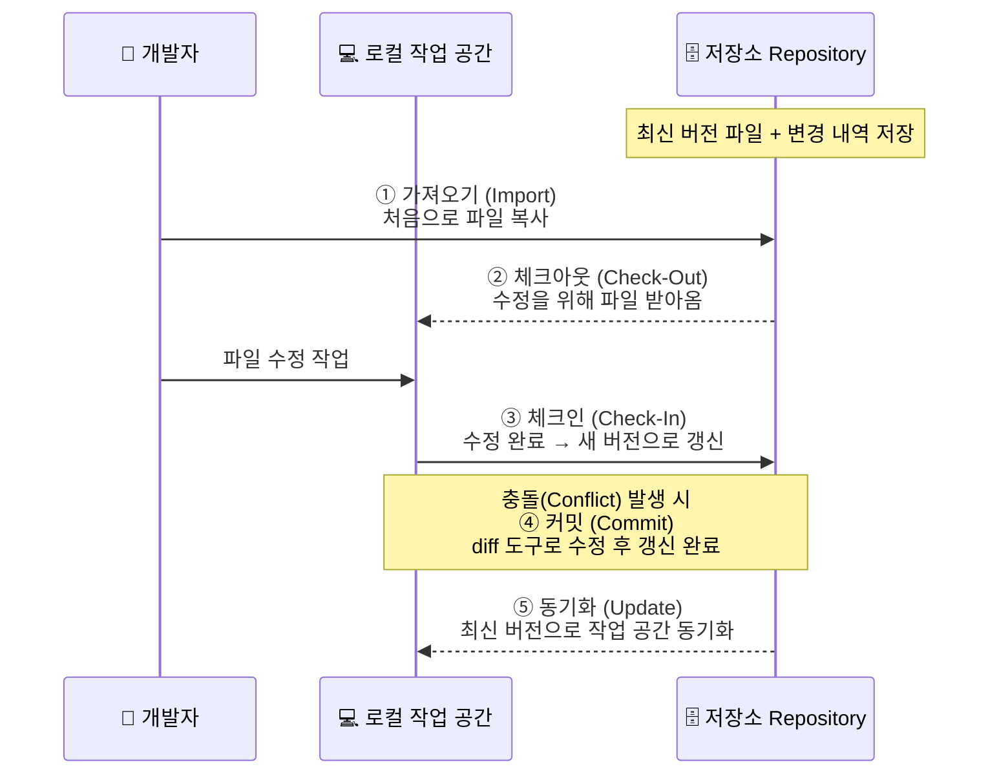
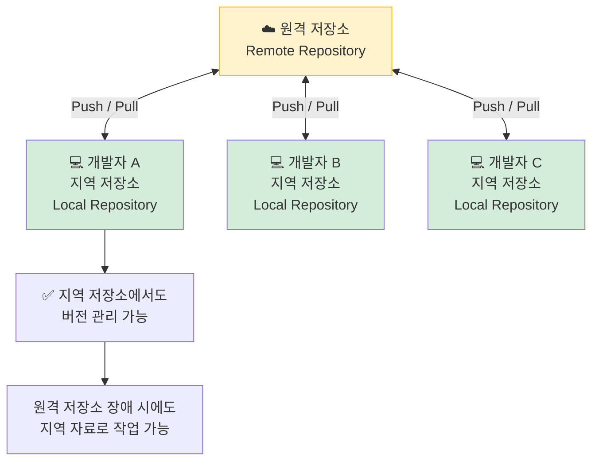
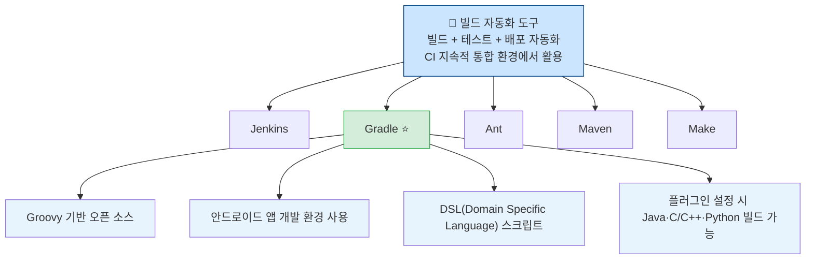

# 12장 제품 소프트웨어 패키징 — 다이어그램 학습

---

## 전체 구조 마인드맵

---

## 릴리즈 노트 작성 항목 (292) ★A

---

## DRM 구성 요소 (293) ★B — 콘텐츠 흐름도

---

## DRM 기술 요소 (294) ★B

---

## 형상 관리 SCM (296~297) ★A

---

## 버전 등록 주요 기능 (298) ★B — 작업 흐름

---

## 분산 저장소 방식 (299)

**종류:** Git, GNU arch, DCVS, Bazaar, Mercurial, TeamWare, Bitkeeper, Plastic SCM

---

## 빌드 자동화 도구 (300~301) ★B

---

## 핵심 암기 요약표

| 번호 | 항목 | 핵심 키워드 | 난이도 |
|------|------|-------------|--------|
| 292 | 릴리즈 노트 항목 (11가지) | Header·개요·목적·문제요약·재현·수정개선·사용자영향도·SW지원·노트·면책·연락처 | **A** |
| 293 | DRM 구성 요소 (7가지) | 클리어링하우스·제공자·패키저·분배자·소비자·컨트롤러·보안컨테이너 | **B** |
| 294 | DRM 기술 요소 (8가지) | 암호화·키관리·파일생성·식별·저작권표현·정책관리·크랙방지·인증 | **B** |
| 296 | 형상 관리 SCM | Git·SVN·CVS / 변경 사항 관리 | **A** |
| 297 | 형상 관리 기능 (5가지) | 형상식별·버전제어·형상통제·형상감사·형상기록 | **A** |
| 298 | 버전 등록 주요 기능 (6가지) | 저장소·가져오기·체크아웃·체크인·커밋·동기화 | **B** |
| 299 | 분산 저장소 방식 | Git / 원격+지역 저장소 함께 관리 | **C** |
| 300 | 빌드 자동화 도구 | Jenkins·Gradle·Ant·Maven·Make | **B** |
| 301 | Gradle | Groovy·DSL·안드로이드·오픈소스 | **C** |

---

*12장 제품 소프트웨어 패키징 (실기_이론(2) p.2 기반)*
