# 1장 요구사항 확인 — 다이어그램 학습

---

## 전체 구조 마인드맵

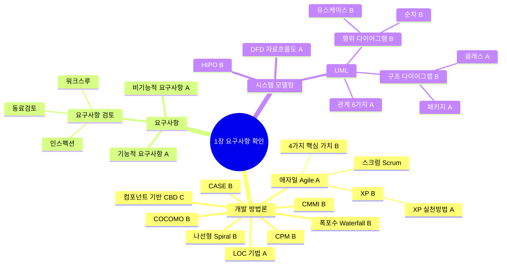

---

## 소프트웨어 개발 방법론 비교 ★B

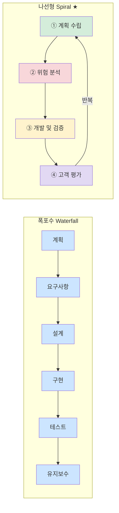

> **나선형 4단계:** 계획수립 → 위험분석 → 개발및검증 → 고객평가 (반복) / 보헴(Boehm) 제안

---

## 애자일 4가지 핵심 가치 ★B

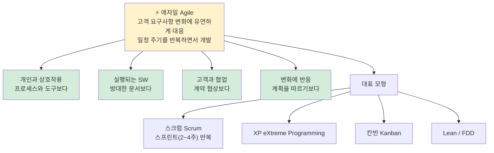

---

## XP 핵심 가치 5가지 + 주요 실천 방법 ★A

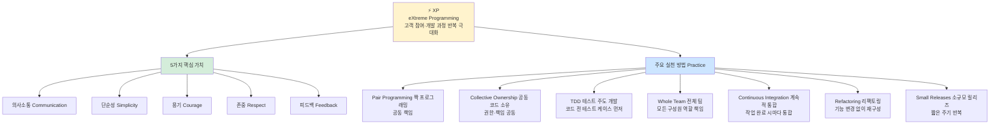

---

## 요구사항 분류 + 검토 방법 ★A

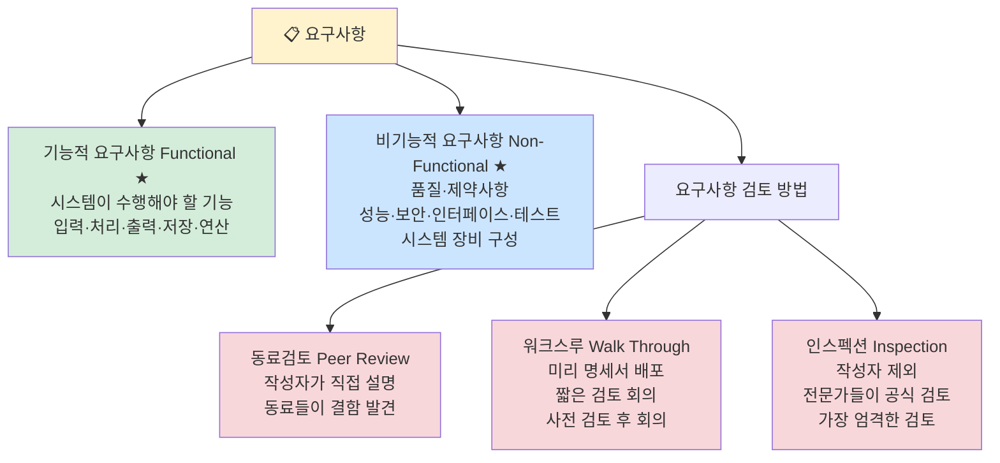

---

## DFD 자료 흐름도 기호 ★A

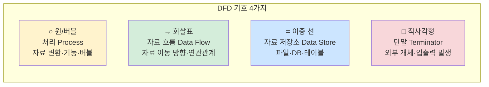

---

## UML 관계 6가지 ★A

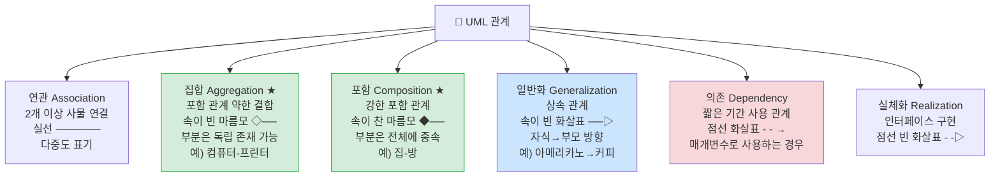

> **집합 vs 포함 구별법:** 집합(◇)은 부분이 독립 / 포함(◆)은 부분이 전체에 종속

---

## UML 다이어그램 분류 ★B

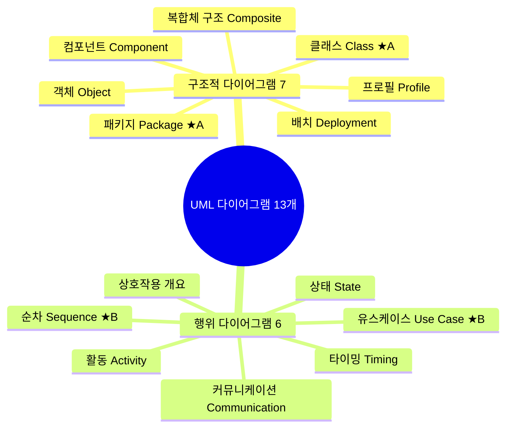

---

## 유스케이스 다이어그램 ★B

```mermaid
graph TD
    UC["👤 유스케이스 다이어그램\n사용자 관점에서\n시스템 기능 표현"]

    UC --> E1["시스템/시스템 범위\n□ 사각형으로 경계 표현"]
    UC --> E2["액터 Actor\n★ 사람 모양\n주액터: 시스템 이득을 얻는 대상\n부액터: 서비스를 제공하는 외부시스템"]
    UC --> E3["유스케이스\n○ 타원으로 표현\n액터에게 제공하는 서비스·기능"]
    UC --> E4["관계 Relationship\n유스케이스 내부 관계"]

    E4 --> R1["포함 include\n점선 화살표+include\n반드시 포함"]
    E4 --> R2["확장 extends\n점선 화살표+extends\n조건부 포함"]
    E4 --> R3["일반화 Generalization\n상속 관계"]

    style UC fill:#cce5ff
    style E2 fill:#d4edda
    style E3 fill:#fff3cd
    style R1 fill:#f8d7da
    style R2 fill:#f8d7da
```

---

## 클래스 다이어그램 ★A

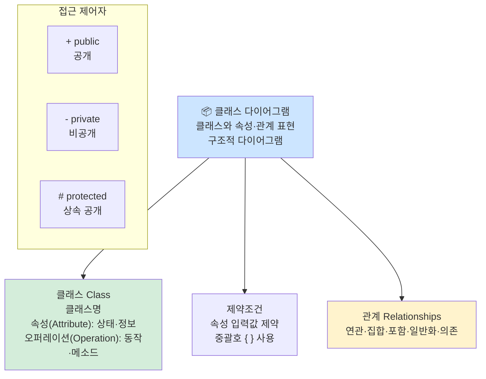

---

## 순차 다이어그램 ★B

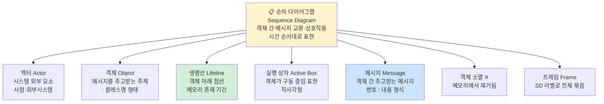

---

## 패키지 다이어그램 ★A

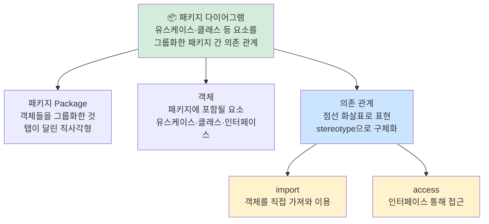

---

## HIPO (Hierarchy Input Process Output) ★B

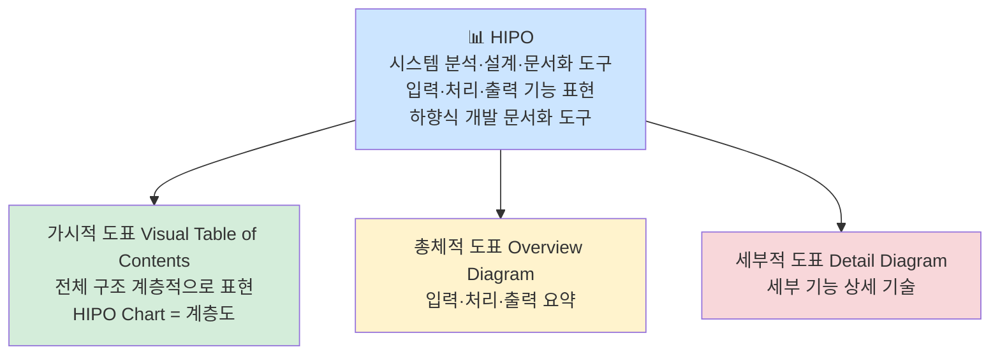

---

## LOC 기법 ★A

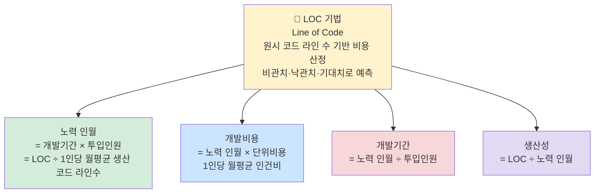

---

## COCOMO 유형 3가지 ★B

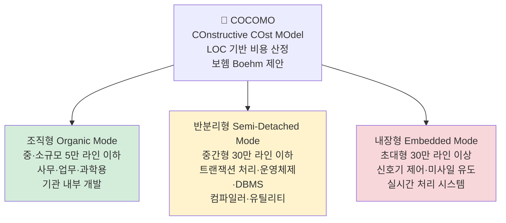

---

## CPM (임계 경로 기법) ★B

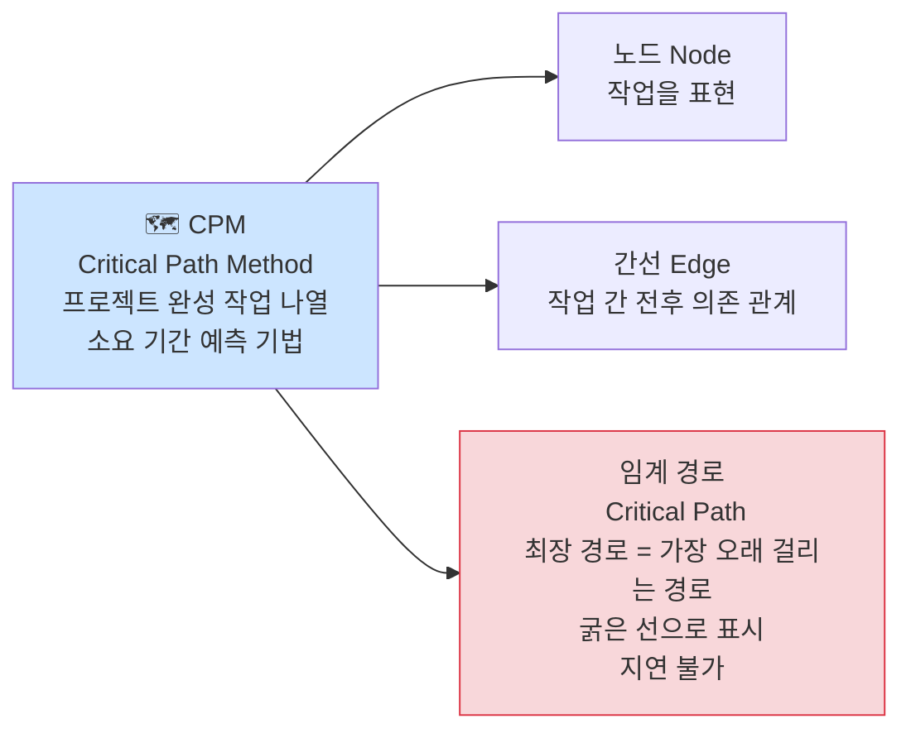

---

## CMMI 성숙도 5단계 ★B

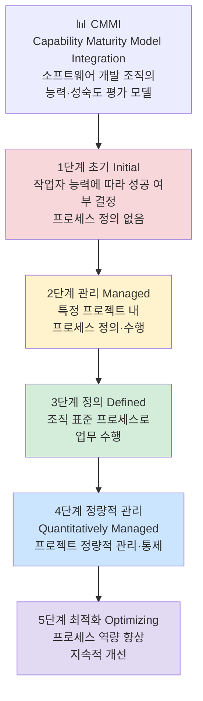

---

## CASE ★B

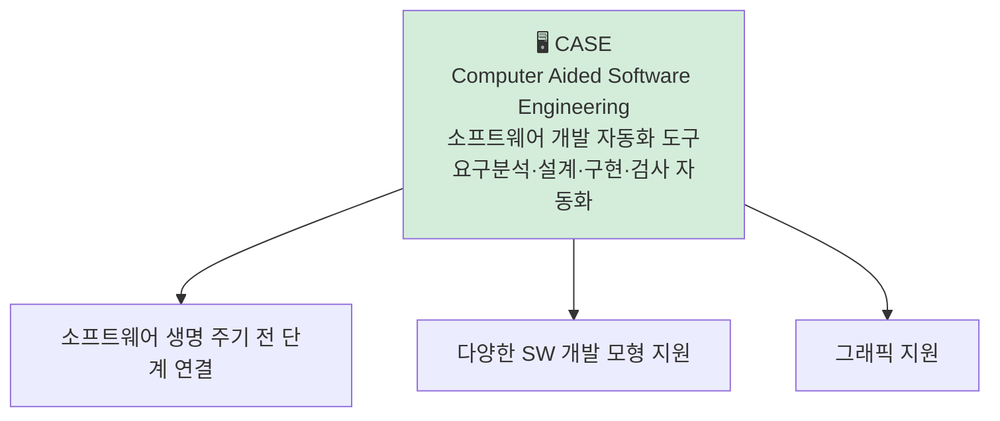

---

## 핵심 암기 요약표

| 번호 | 항목 | 핵심 키워드 | 난이도 |
|------|------|-------------|--------|
| 001 | 나선형 모델 | 계획→위험분석→개발→고객평가 반복, 보헴 | **B** |
| 002 | 폭포수 모델 | 순차적·단방향·이전 단계 복귀 어려움 | **B** |
| 003 | 애자일 모형 | 변화 대응·주기 반복·고객 소통 | **A** |
| 004 | 애자일 4가지 핵심 가치 | 개인/SW/협업/변화 중시 | **B** |
| 005 | XP | 고객 참여·개발 반복 극대화 | **B** |
| 006 | XP 주요 실천 방법 | Pair·TDD·Refactoring·CI·Small Release | **A** |
| 007 | 기능적 요구사항 | 시스템이 수행해야 할 기능 | **A** |
| 008 | 비기능적 요구사항 | 성능·보안·품질·제약사항 | **A** |
| 010 | DFD 4기호 | 원(처리)·화살표(흐름)·이중선(저장소)·사각형(단말) | **A** |
| 011 | HIPO | 입출력 기능 표현, 하향식 문서화 도구 | **B** |
| 012 | 연관 관계 | 실선, 다중도 표기 | **A** |
| 013 | 집합 관계 | 속이 빈 마름모 ◇, 부분은 독립 | **A** |
| 014 | 일반화 관계 | 상속, 자식→부모 방향 속이 빈 화살표 | **A** |
| 015 | 의존 관계 | 점선 화살표, 짧은 기간만 관계 | **A** |
| 016 | 구조적 다이어그램 | 클래스·객체·컴포넌트·배치·패키지 | **B** |
| 017 | 행위 다이어그램 | 유스케이스·순차·상태·활동 | **B** |
| 018 | 유스케이스 다이어그램 | 액터+유스케이스, include/extends | **B** |
| 019 | 클래스 다이어그램 | 클래스명+속성+오퍼레이션, 제약조건 { } | **A** |
| 020 | 순차 다이어그램 | 생명선·실행상자·메시지, 시간 순서 | **B** |
| 021 | 패키지 다이어그램 | 패키지 간 의존 관계, import/access | **A** |
| 023 | CASE | SW 개발 자동화, 그래픽 지원 | **B** |
| 024 | LOC 기법 | 노력=기간×인원, 생산성=LOC/노력 | **A** |
| 027 | COCOMO 3유형 | 조직형(5만↓)·반분리형(30만↓)·내장형(30만↑) | **B** |
| 029 | CPM | 임계경로=최장경로, 노드=작업·간선=의존관계 | **B** |
| 030 | CMMI 5단계 | 초기→관리→정의→정량적관리→최적화 | **B** |

---

*1장 요구사항 확인 (실기_이론(1) p.2~3 기반)*
