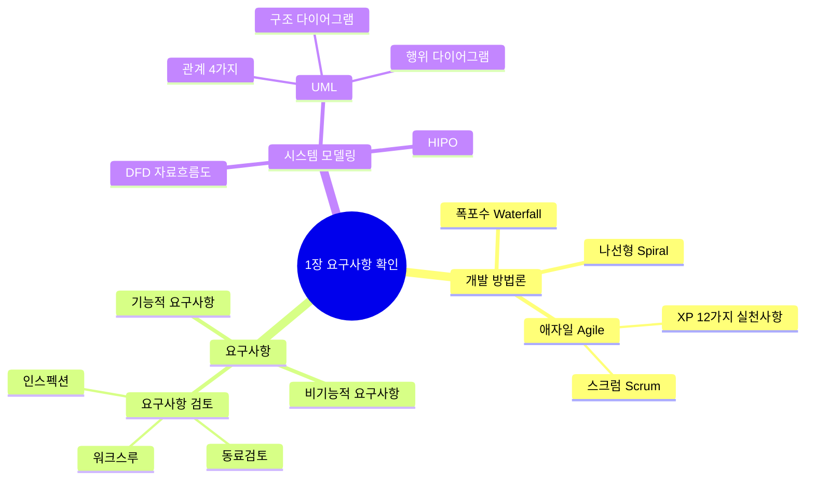
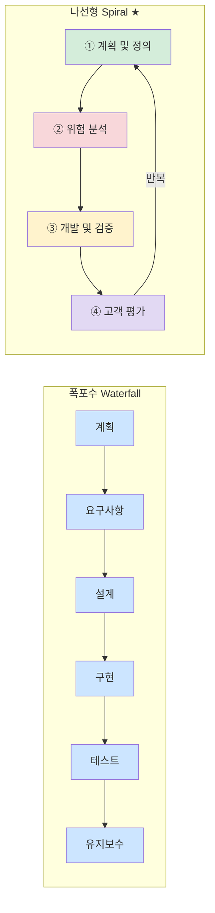
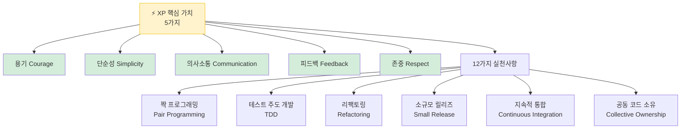
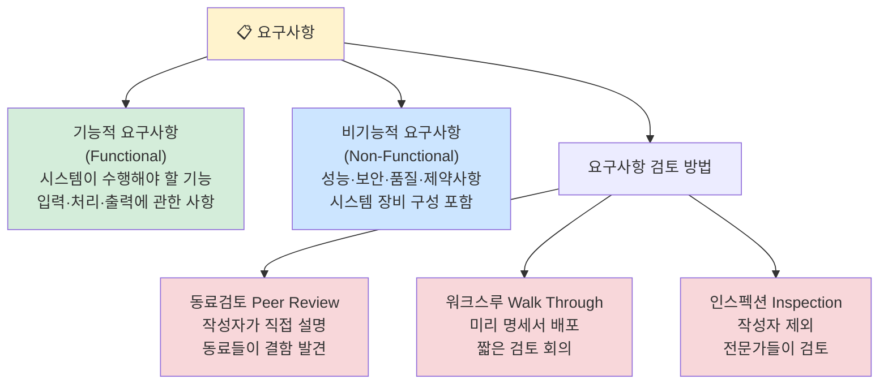
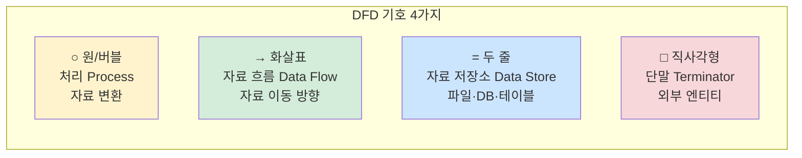
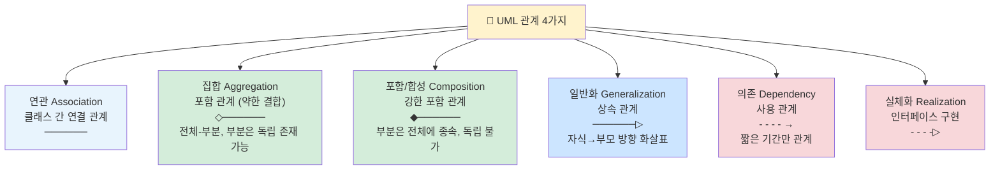
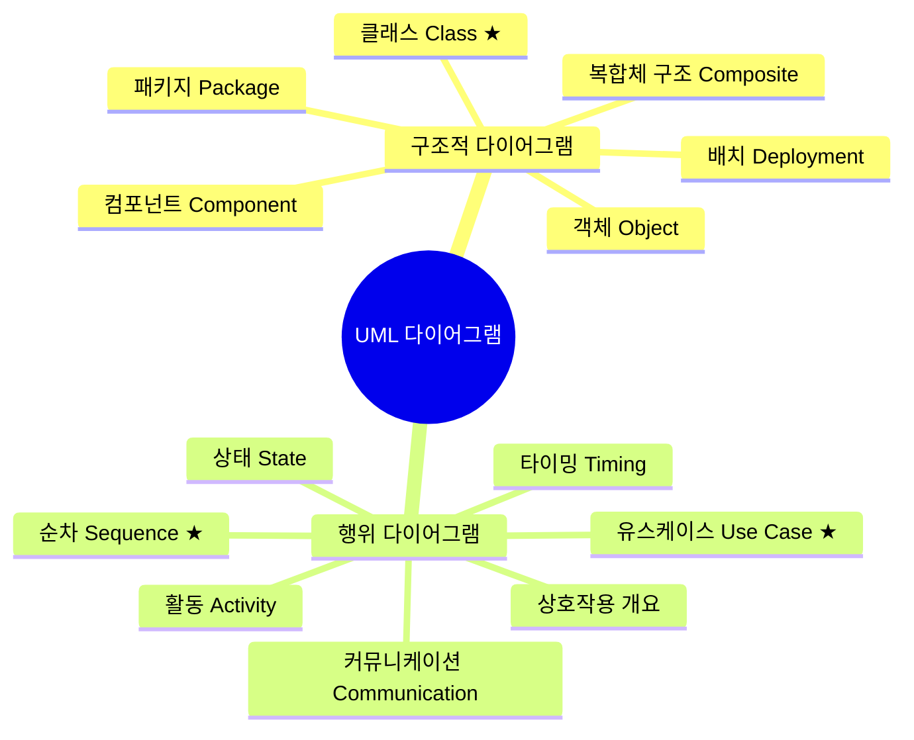
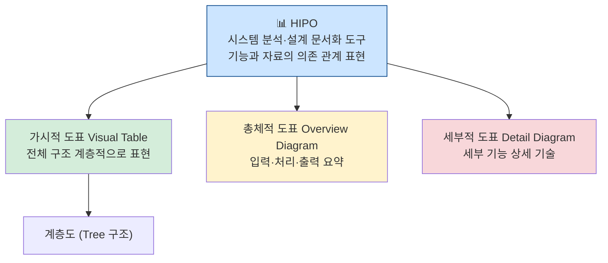

# 1장 요구사항 확인 — 다이어그램 학습

---

## 전체 구조 마인드맵

---

## 소프트웨어 개발 방법론 비교 ★A

**나선형 4단계:** 계획→위험분석→개발및검증→고객평가 (반복)

---

## 애자일 — XP(eXtreme Programming) ★A

---

## 요구사항 분류 ★A

---

## DFD 자료 흐름도 기호 ★A

**DFD 작성 원칙:** 자료는 처리를 거쳐야만 변환 가능 / 자료 보존의 원칙

---

## UML 관계 4가지 ★A

---

## UML 다이어그램 분류 ★A

| 다이어그램 | 용도 | 중요도 |
|------------|------|--------|
| 유스케이스 | 시스템 기능·액터 관계 표현 | **A** |
| 클래스 | 클래스 구조·관계 표현 | **A** |
| 순차(시퀀스) | 시간 순서 메시지 흐름 | **A** |
| 패키지 | 모델 요소의 그룹 | **B** |
| 활동 | 처리 흐름·알고리즘 | **B** |

---

## HIPO (Hierarchy Input Process Output)

---

## 핵심 암기 요약표

| 번호 | 항목 | 핵심 키워드 | 난이도 |
|------|------|-------------|--------|
| 001 | 폭포수 모델 | 순차적·단방향·이전 단계 복귀 어려움 | **A** |
| 002 | 나선형 모델 | 계획→위험분석→개발→고객평가 반복 | **A** |
| 003 | XP 핵심 가치 | 용기·단순성·의사소통·피드백·존중 | **A** |
| 004 | 스크럼 | 스프린트(2~4주) 반복, 데일리 스크럼 | **B** |
| 005 | 기능적 요구사항 | 시스템이 수행해야 할 기능 | **A** |
| 006 | 비기능적 요구사항 | 성능·보안·품질·제약사항 | **A** |
| 007 | 동료검토 | 작성자가 직접 설명, 동료가 결함 발견 | **B** |
| 008 | 워크스루 | 미리 배포, 짧은 검토 회의 | **B** |
| 009 | 인스펙션 | 작성자 제외, 전문가 검토 | **B** |
| 010 | DFD 처리 | 원(버블)로 표현 | **A** |
| 011 | UML 집합 vs 포함 | 집합(◇·독립) vs 포함(◆·종속) | **A** |
| 012 | 구조적 다이어그램 | 클래스·객체·컴포넌트·배치·패키지 | **A** |
| 013 | 행위 다이어그램 | 유스케이스·순차·상태·활동 | **A** |

---

*1장 요구사항 확인 (실기_이론(1) p.2~3 기반)*
