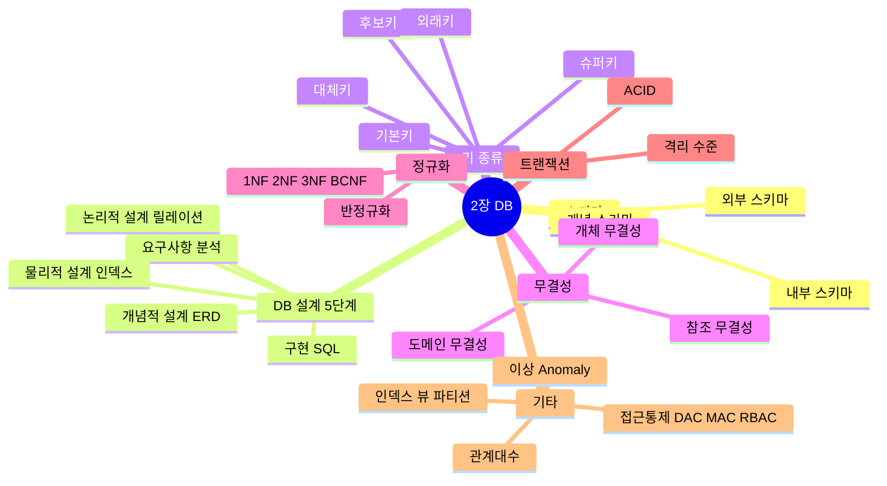
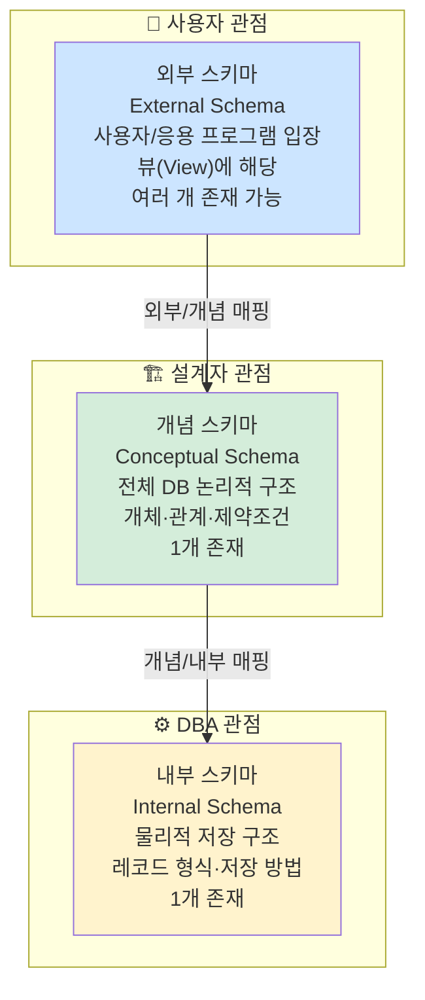
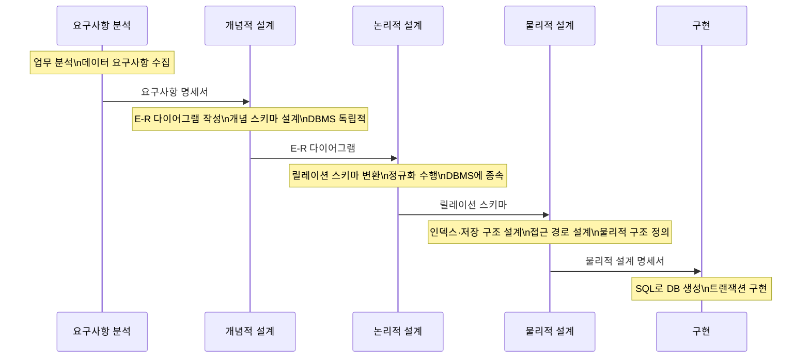
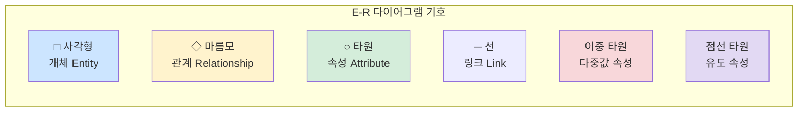
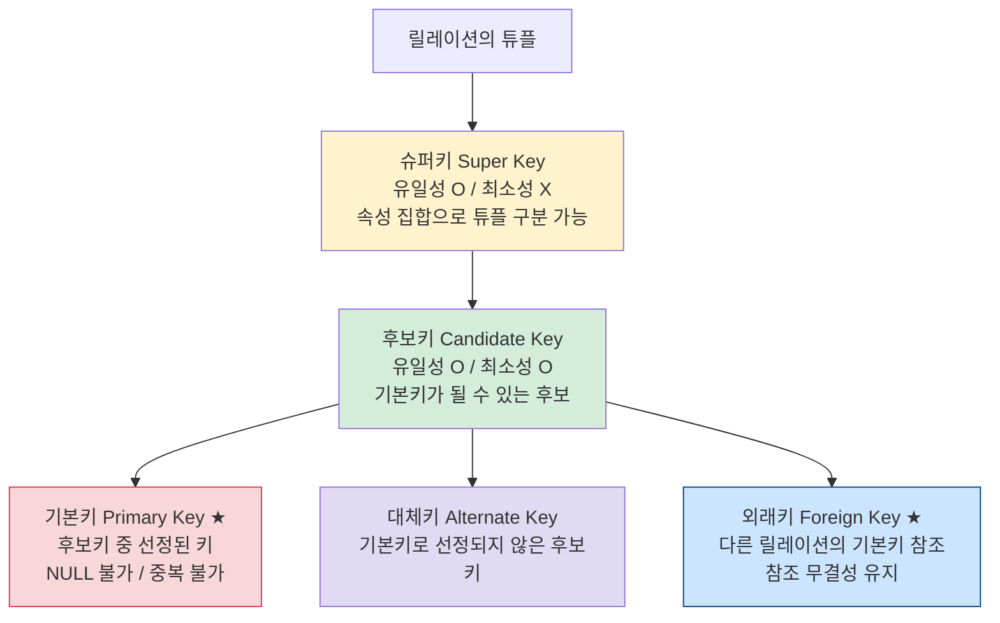
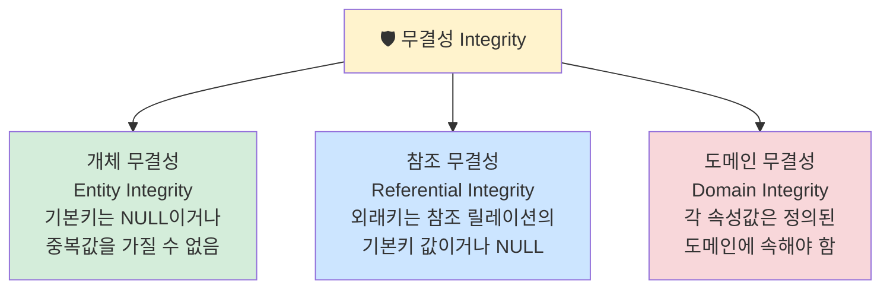
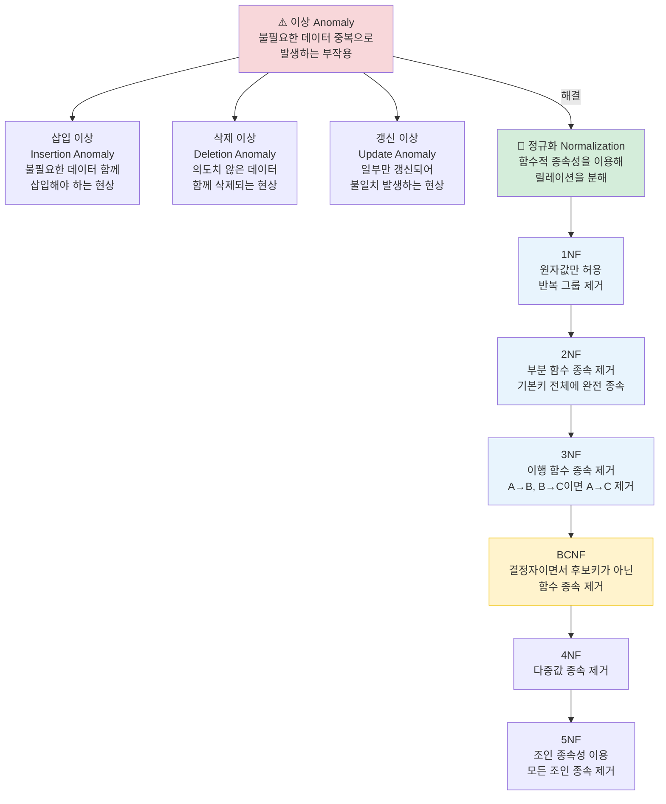
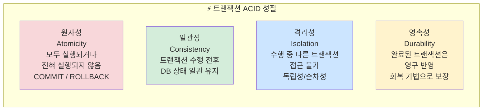
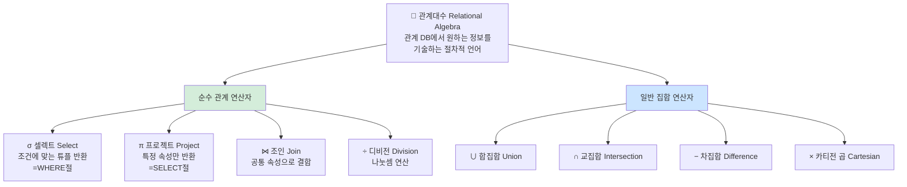
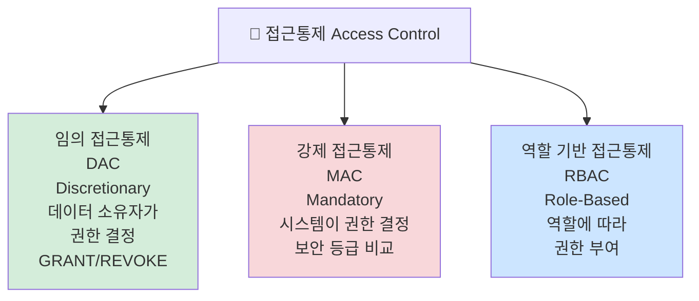

# 2장 데이터 입출력 구현 — 다이어그램 학습

---

## 전체 구조 마인드맵

---

## 스키마 3계층 ★A

---

## DB 설계 5단계 ★A

---

## E-R 다이어그램 기호

---

## 키(Key) 종류 ★A

---

## 무결성 제약조건 ★A

---

## 이상(Anomaly)과 정규화 ★A

---

## 트랜잭션 ACID ★A

---

## 관계대수 연산자 ★B

---

## 접근통제 3가지 ★B

---

## 핵심 암기 요약표

| 번호 | 항목 | 핵심 키워드 | 난이도 |
|------|------|-------------|--------|
| 030 | 스키마 3종류 | 외부(사용자)·개념(논리)·내부(물리) | **A** |
| 031 | DB 설계 5단계 | 요구→개념(ERD)→논리(릴레이션)→물리→구현 | **A** |
| 032 | 기본키 특성 | 유일성+최소성, NULL 불가, 중복 불가 | **A** |
| 033 | 외래키 | 다른 릴레이션의 기본키 참조 | **A** |
| 034 | 개체 무결성 | 기본키 = NULL 불가, 중복 불가 | **A** |
| 035 | 참조 무결성 | 외래키 = 참조 기본키값 or NULL | **A** |
| 036 | 삽입 이상 | 원치 않는 데이터 함께 삽입 강요 | **A** |
| 037 | 1NF | 원자값만 허용 | **A** |
| 038 | 2NF | 완전 함수 종속 (부분 종속 제거) | **A** |
| 039 | 3NF | 이행 함수 종속 제거 | **A** |
| 040 | BCNF | 결정자가 모두 후보키 | **A** |
| 041 | 반정규화 | 성능 향상 위해 의도적 중복 허용 | **B** |
| 042 | 트랜잭션 ACID | 원자성·일관성·격리성·영속성 | **A** |
| 043 | 셀렉트(σ) | 조건에 맞는 튜플 선택 | **B** |
| 044 | 프로젝트(π) | 특정 속성만 추출 | **B** |
| 045 | DAC/MAC/RBAC | 임의/강제/역할기반 접근통제 | **B** |

---

*2장 데이터 입출력 구현 (실기_이론(1) p.3~4 기반)*
