# 2장 데이터 입출력 구현 — 다이어그램 학습

---

## 전체 구조 마인드맵

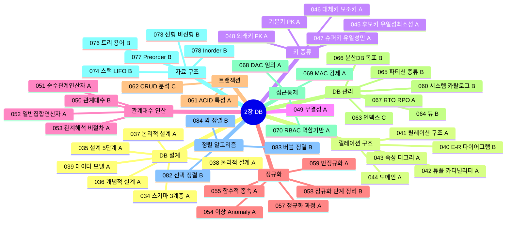

---

## 스키마 3계층 ★A

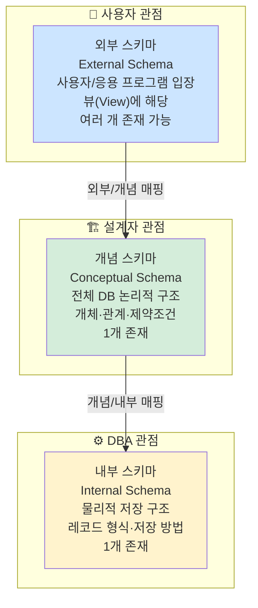

---

## DB 설계 5단계 ★A

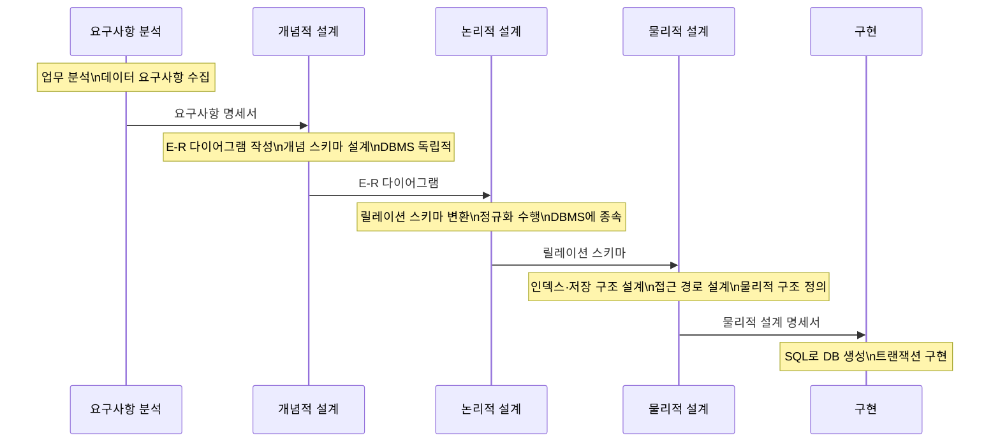

---

## 개념적·논리적·물리적 설계 ★A

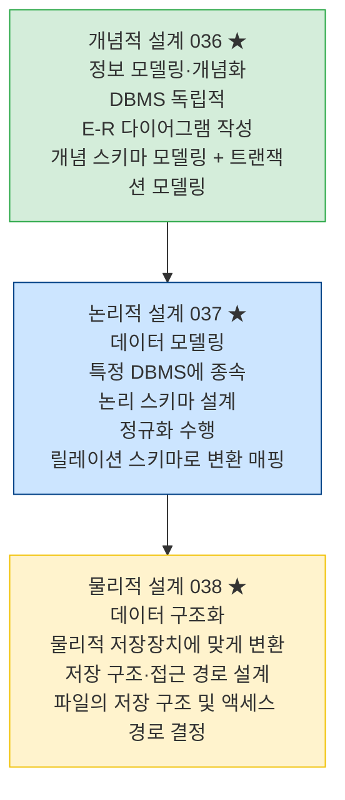

---

## 데이터 모델 3요소 ★A

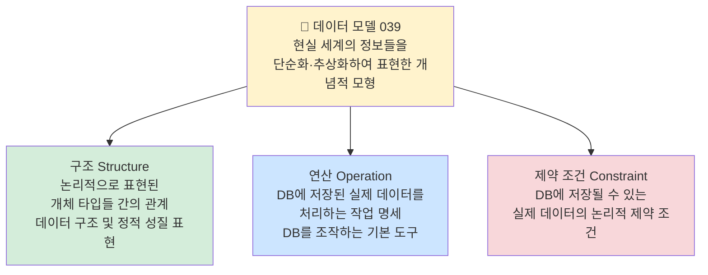

---

## E-R 다이어그램 기호 ★B

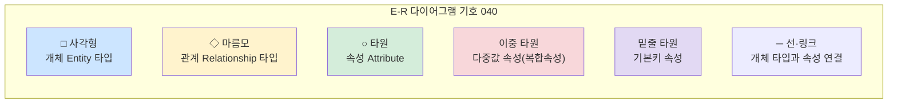

---

## 릴레이션 구조 + 용어 ★A

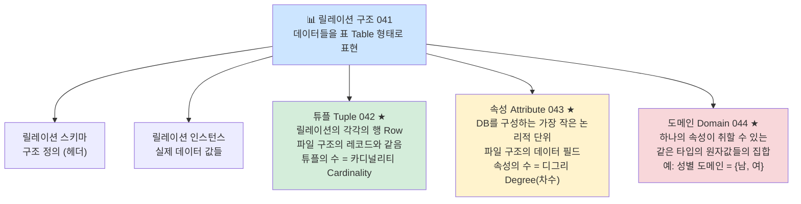

---

## 키(Key) 종류 ★A

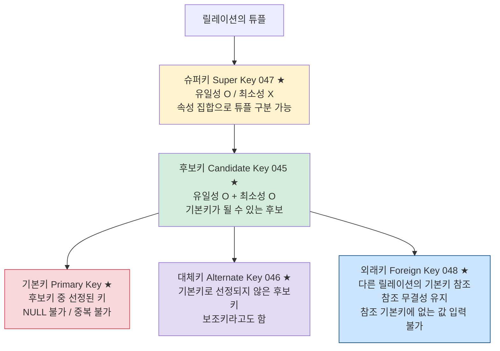

---

## 무결성 제약조건 ★A

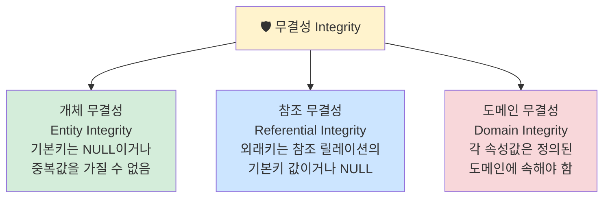

---

## 이상(Anomaly)과 정규화 ★A

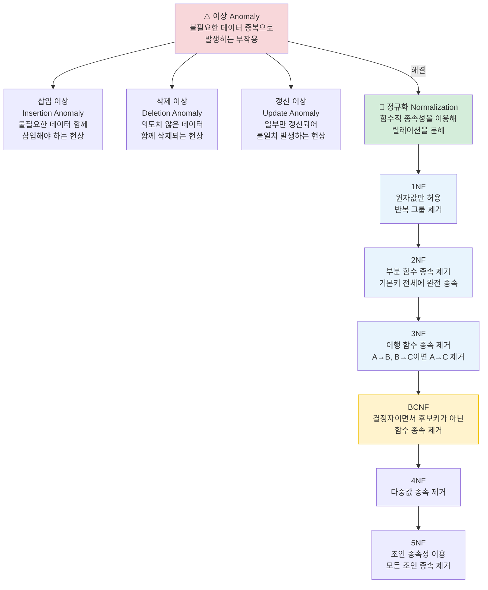

---

## 트랜잭션 ACID ★A

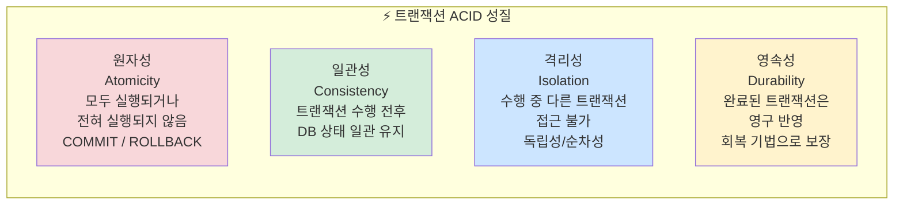

---

## 함수적 종속 ★A

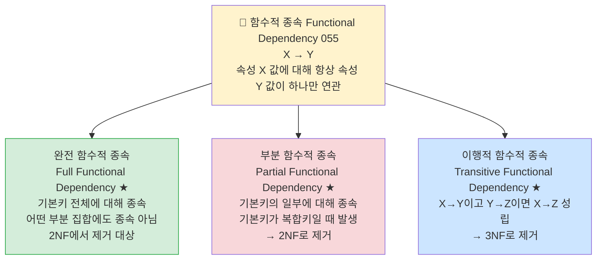

---

## 관계대수 연산자 ★B

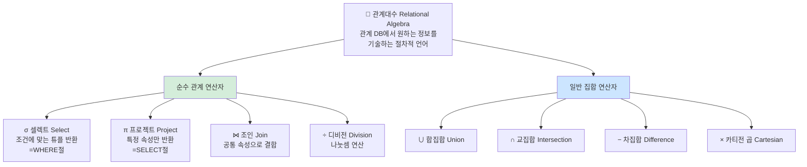

---

## 일반 집합 연산자 ★A

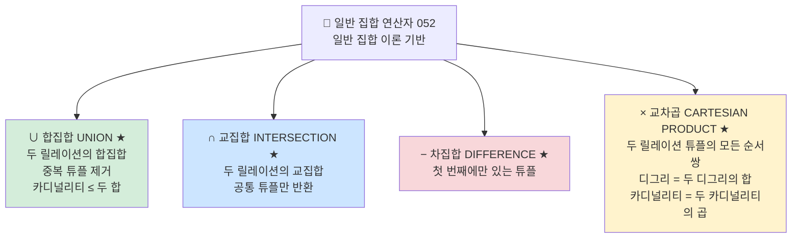

---

## 관계해석 ★A

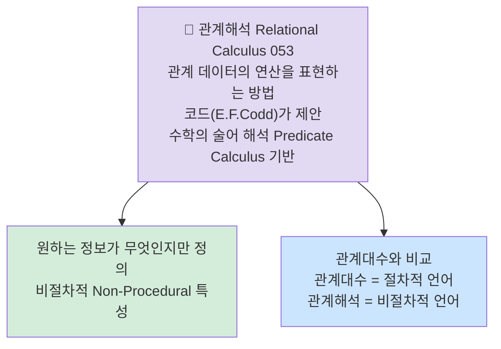

---

## 접근통제 3가지 ★B

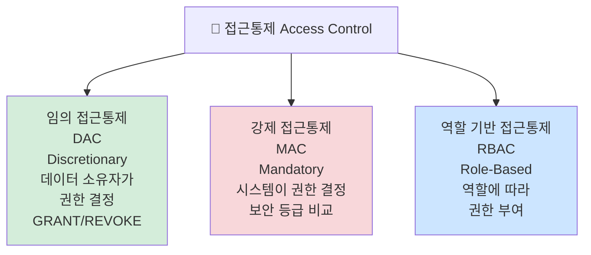

---

## 반정규화 ★A

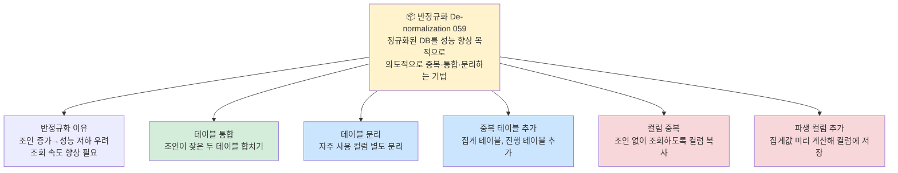

---

## 시스템 카탈로그 ★B

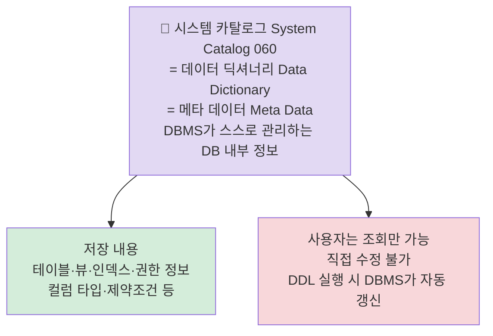

---

## 뷰(View) ★B

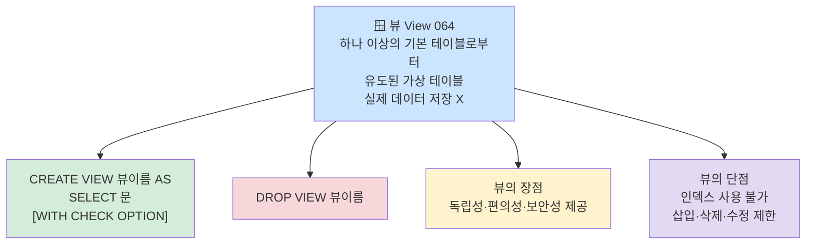

---

## 파티션의 종류 ★B

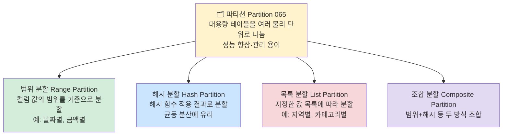

---

## 분산 데이터베이스의 목표 ★B

```mermaid
graph TD
    DIST["🌐 분산 데이터베이스 목표 066\n여러 사이트에 분산된 DB\n사용자에게 단일 DB처럼 보이도록"]

    DIST --> T1["위치 투명성 Location Transparency\n데이터가 어느 사이트에 있는지 몰라도 접근 가능"]
    DIST --> T2["중복 투명성 Replication Transparency\n데이터 복제 여부를 몰라도 사용 가능"]
    DIST --> T3["병행 투명성 Concurrency Transparency\n다수 사용자가 동시 접근해도 일관성 유지"]
    DIST --> T4["장애 투명성 Failure Transparency\n일부 사이트 장애 발생해도 작업 계속 가능"]

    style DIST fill:#e2d9f3
    style T1 fill:#d4edda
    style T2 fill:#cce5ff
    style T3 fill:#fff3cd
    style T4 fill:#f8d7da
```

---

## RTO / RPO ★A

```mermaid
graph LR
    subgraph RECOVER["복구 목표 067"]
        RTO["RTO\nRecovery Time Objective\n목표 복구 시간\n장애 발생 후\n서비스 재개까지\n허용 시간"]
        RPO["RPO\nRecovery Point Objective\n목표 복구 시점\n복구 시 허용되는\n데이터 손실 기준 시점\n(어느 시점까지 복구할 것인가)"]
    end

    style RTO fill:#f8d7da
    style RPO fill:#cce5ff
```

---

## 자료 구조의 분류 ★B

```mermaid
graph TD
    DS["📊 자료 구조 Data Structure 073"]

    DS --> L["선형 구조 Linear\n데이터가 일렬로 나열"]
    DS --> NL["비선형 구조 Non-linear\n데이터가 계층·망형으로 연결"]

    L --> L1["배열 Array\n동일 타입, 연속 메모리\n인덱스로 접근 O(1)"]
    L --> L2["스택 Stack\nLIFO (후입선출)"]
    L --> L3["큐 Queue\nFIFO (선입선출)"]
    L --> L4["덱 Deque\n양쪽 끝 삽입·삭제 가능"]

    NL --> NL1["트리 Tree\n계층 구조\n사이클 없음"]
    NL --> NL2["그래프 Graph\n망형 구조\n사이클 가능"]

    style DS fill:#e2d9f3
    style L fill:#d4edda
    style NL fill:#cce5ff
    style L2 fill:#fff3cd
    style NL1 fill:#fff3cd
```

---

## 스택(Stack) ★B

```mermaid
graph TD
    ST["📚 스택 Stack 074\nLIFO (Last In First Out)\n후입선출\n한쪽 끝에서만 삽입·삭제"]

    ST --> OP["주요 연산\nPUSH: 데이터 삽입 (top+1)\nPOP: 데이터 삭제 (top-1)\nPEEK/TOP: 스택 top 확인"]
    ST --> OV["오버플로 Overflow\n스택이 꽉 찬 상태에서 PUSH 시도"]
    ST --> UN["언더플로 Underflow\n스택이 빈 상태에서 POP 시도"]
    ST --> USE["활용 예\n함수 호출 스택\n수식 괄호 검사\n역순 문자열 출력"]

    style ST fill:#fff3cd
    style OP fill:#d4edda
    style OV fill:#f8d7da
    style UN fill:#f8d7da
    style USE fill:#cce5ff
```

---

## 트리 관련 용어 ★B

```mermaid
graph TD
    TREE["🌳 트리 Tree 076\n계층 구조, 사이클 없는 그래프"]

    TREE --> T1["노드 Node\n트리의 기본 요소"]
    TREE --> T2["루트 Root\n최상위 노드 (부모 없음)"]
    TREE --> T3["단말 노드 Leaf Node\n자식 없는 노드 = 단풍잎"]
    TREE --> T4["디그리 Degree\n노드의 자식 수"]
    TREE --> T5["깊이 Depth / 레벨 Level\n루트에서 해당 노드까지 거리"]
    TREE --> T6["이진 트리 Binary Tree\n각 노드의 자식이 최대 2개"]

    style TREE fill:#d4edda
    style T2 fill:#fff3cd
    style T3 fill:#cce5ff
    style T6 fill:#f8d7da
```

---

## 트리 순회 (Preorder / Inorder / Postorder) ★B

```mermaid
graph TD
    TRAV["🔄 트리 운행법 Tree Traversal 077-078"]

    TRAV --> PRE["Preorder 전위 순회 077\nRoot → Left → Right\n루트를 먼저 방문"]
    TRAV --> IN["Inorder 중위 순회 078\nLeft → Root → Right\n루트를 중간에 방문\n이진탐색트리: 오름차순 출력"]
    TRAV --> POST["Postorder 후위 순회\nLeft → Right → Root\n루트를 마지막에 방문"]

    style PRE fill:#d4edda
    style IN fill:#cce5ff
    style POST fill:#fff3cd
```

```
          A
         / \
        B   C
       / \
      D   E

Preorder : A B D E C  (Root→L→R)
Inorder  : D B E A C  (L→Root→R)
Postorder: D E B C A  (L→R→Root)
```

---

## 정렬 알고리즘 ★B

```mermaid
graph TD
    SORT["🔢 정렬 Sort 082-084"]

    SORT --> SEL["선택 정렬 Selection Sort 082\nO(n²)\n전체에서 최솟값 선택 → 맨 앞과 교환\n비교 횟수 일정"]
    SORT --> BUB["버블 정렬 Bubble Sort 083\nO(n²)\n인접한 두 원소 비교 후 교환\n구현 단순, 속도 느림"]
    SORT --> QK["퀵 정렬 Quick Sort 084\n평균 O(n log n)\n최악 O(n²) (이미 정렬된 경우)\n피벗 기준 분할 정복\n실제로 가장 빠름"]

    style SORT fill:#e2d9f3
    style SEL fill:#fff3cd
    style BUB fill:#d4edda
    style QK fill:#cce5ff
```

| 정렬 | 최선 | 평균 | 최악 | 특징 |
|------|------|------|------|------|
| 선택 | O(n²) | O(n²) | O(n²) | 비교 횟수 고정 |
| 버블 | O(n) | O(n²) | O(n²) | 구현 단순 |
| 퀵 | O(n log n) | O(n log n) | O(n²) | 평균 가장 빠름 |
| 병합 | O(n log n) | O(n log n) | O(n log n) | 안정 정렬 |

---

## 핵심 암기 요약표

| 번호 | 항목 | 핵심 키워드 | 난이도 |
|------|------|-------------|--------|
| 034 | 개체 무결성 | 기본키 = NULL 불가, 중복 불가 | **A** |
| 035 | 참조 무결성 | 외래키 = 참조 기본키값 or NULL | **A** |
| 036 | 개념적 설계 | ERD 작성 단계 | **A** |
| 037 | 논리적 설계 | 릴레이션 스키마 변환 | **A** |
| 038 | 물리적 설계 | 저장구조·접근경로 설계 | **A** |
| 039 | 데이터 모델 3요소 | 구조·연산·제약조건 | **A** |
| 040 | E-R 기호 | 사각형=개체/타원=속성/밑줄타원=기본키/마름모=관계 | **B** |
| 041 | 튜플/카디널리티 | 행(Row), 튜플 수=카디널리티 | **A** |
| 042 | 속성/디그리 | 열(Column), 속성 수=디그리 | **A** |
| 043 | 도메인 | 속성이 가질 수 있는 값의 범위 | **A** |
| 044 | 후보키 | 유일성+최소성 모두 만족 | **A** |
| 045 | 기본키 | 후보키 중 선택, NULL 불가 | **A** |
| 046 | 대체키 | 후보키 중 기본키 외 나머지 (=보조키) | **A** |
| 047 | 슈퍼키 | 유일성O 최소성X | **A** |
| 048 | 외래키 | 다른 릴레이션의 기본키 참조 | **A** |
| 050 | 이상(Anomaly) | 삽입·삭제·갱신 이상 | **A** |
| 052 | 일반 집합 연산자 | ∪합집합 ∩교집합 −차집합 ×교차곱 | **A** |
| 053 | 관계해석 | 비절차적, 원하는 결과만 기술 | **A** |
| 055 | 함수적 종속 | 완전·부분·이행적 함수종속 | **A** |
| 056 | 1NF | 원자값만 허용 | **A** |
| 057 | 2NF | 부분 함수 종속 제거 | **A** |
| 058 | 3NF/BCNF | 이행 종속 제거 / 결정자=후보키 | **B** |
| 059 | 반정규화 | 성능 향상, 의도적 중복·통합·분리 | **A** |
| 060 | 시스템 카탈로그 | 데이터 딕셔너리, 메타데이터 | **B** |
| 064 | 뷰(View) | 가상 테이블, CREATE VIEW AS SELECT | **B** |
| 065 | 파티션 종류 | 범위·해시·목록·조합 분할 | **B** |
| 066 | 분산DB 목표 | 위치·중복·병행·장애 투명성 | **B** |
| 067 | RTO/RPO | 목표복구시간 / 목표복구시점 | **A** |
| 073 | 자료 구조 분류 | 선형(배열·스택·큐·덱) 비선형(트리·그래프) | **B** |
| 074 | 스택 | LIFO, 오버플로/언더플로 | **B** |
| 076 | 트리 용어 | 노드·루트·단말·디그리·깊이 | **B** |
| 077 | Preorder | Root→Left→Right | **B** |
| 078 | Inorder | Left→Root→Right | **B** |
| 082 | 선택 정렬 | O(n²), 최솟값 찾아 교환 | **B** |
| 083 | 버블 정렬 | O(n²), 인접 비교 교환 | **B** |
| 084 | 퀵 정렬 | 평균 O(n log n), 피벗 분할 | **B** |

---

*2장 데이터 입출력 구현 (실기_이론(1) p.3~4 기반)*
