# 3-4장 통합 구현 + 서버 프로그램 구현 — 다이어그램 학습

---

## 전체 구조 마인드맵

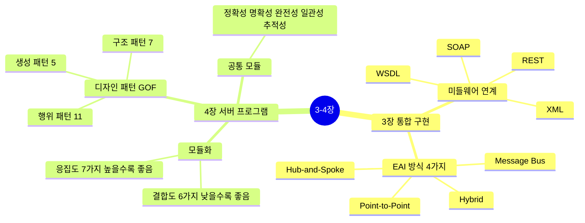

---

## 3장: EAI 연계 방식 4가지 ★A

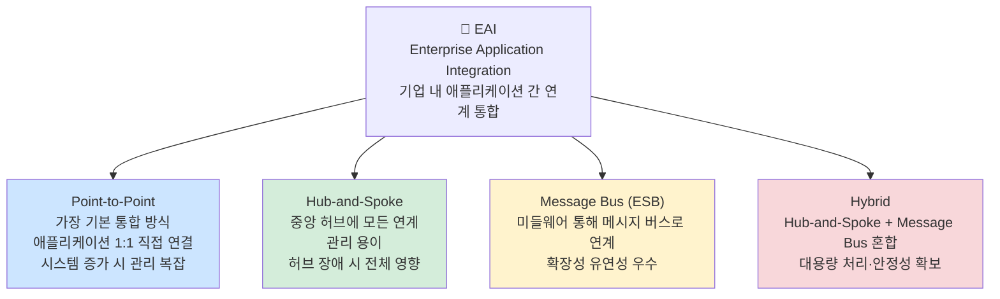

---

## 3장: 웹 서비스 기술 스택 ★B

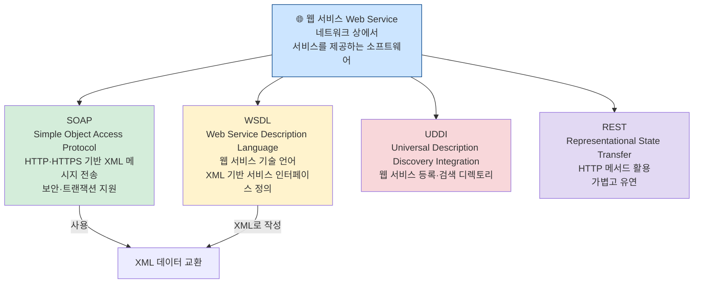

---

## 4장: 결합도(Coupling) 6가지 ★A — 낮을수록 좋음

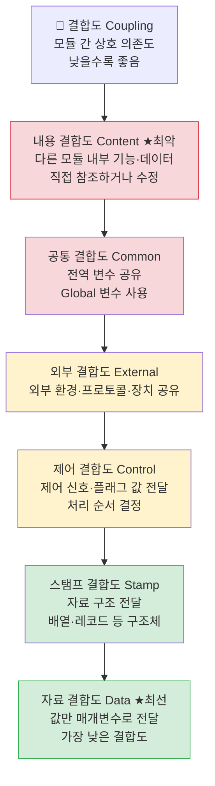

> 암기법: **내공외제스자** (내→공→외→제어→스탬프→자료, 나쁨→좋음)

---

## 4장: 응집도(Cohesion) 7가지 ★A — 높을수록 좋음

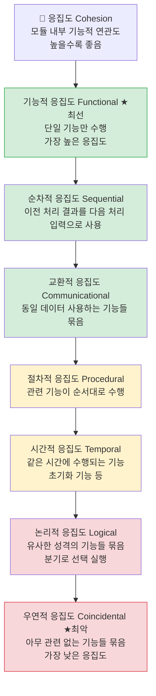

> 암기법: **기순교절시논우** (좋음→나쁨)

---

## 4장: GOF 디자인 패턴 23가지 ★A

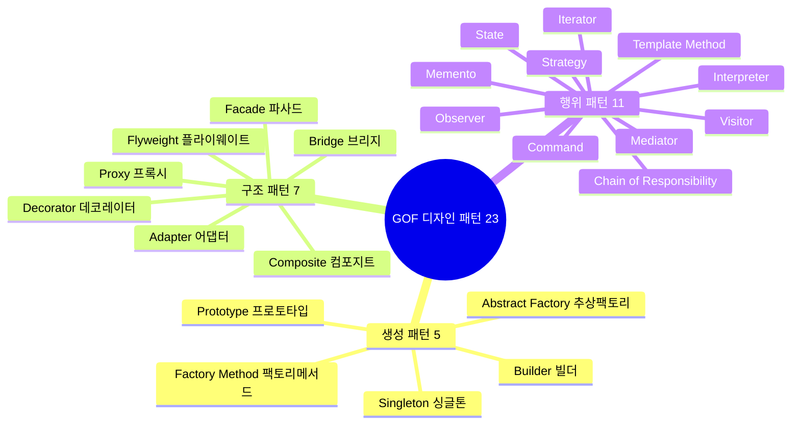

---

## 4장: 주요 디자인 패턴 정리 ★A

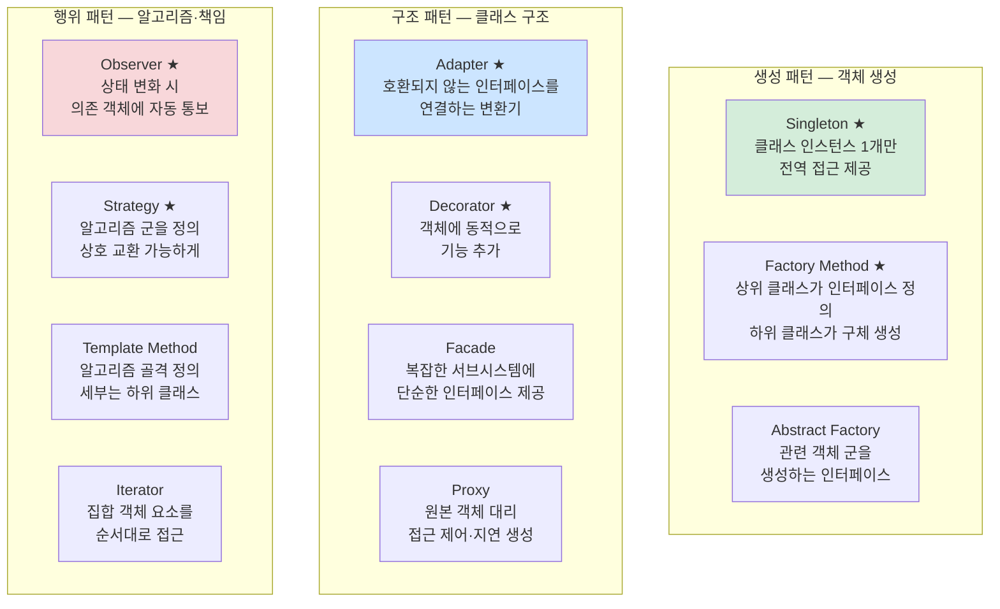

---

## 3장: XML ★A

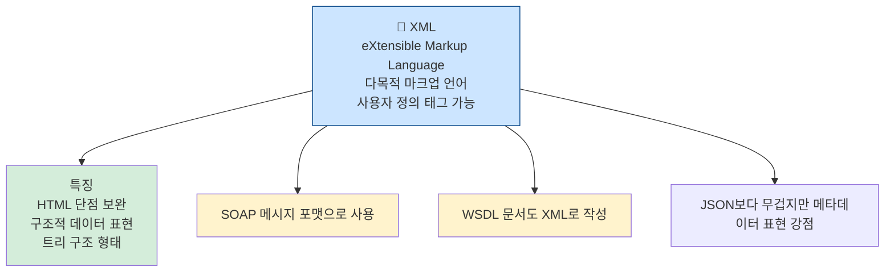

---

## 4장: 모듈화 ★A

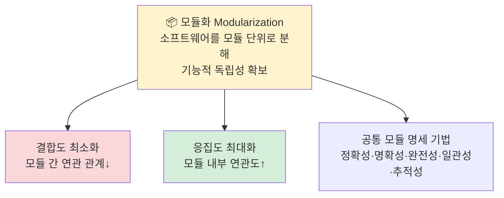

---

## 4장: 아키텍처 패턴 ★B

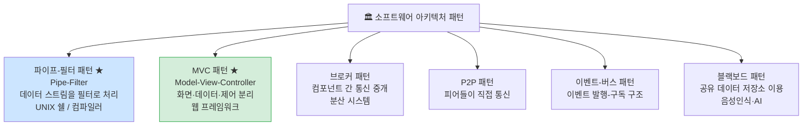

---

## 4장: 객체지향 핵심 개념 ★B

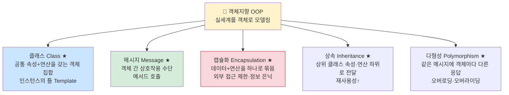

---

## 4장: 럼바우의 분석 기법 ★A

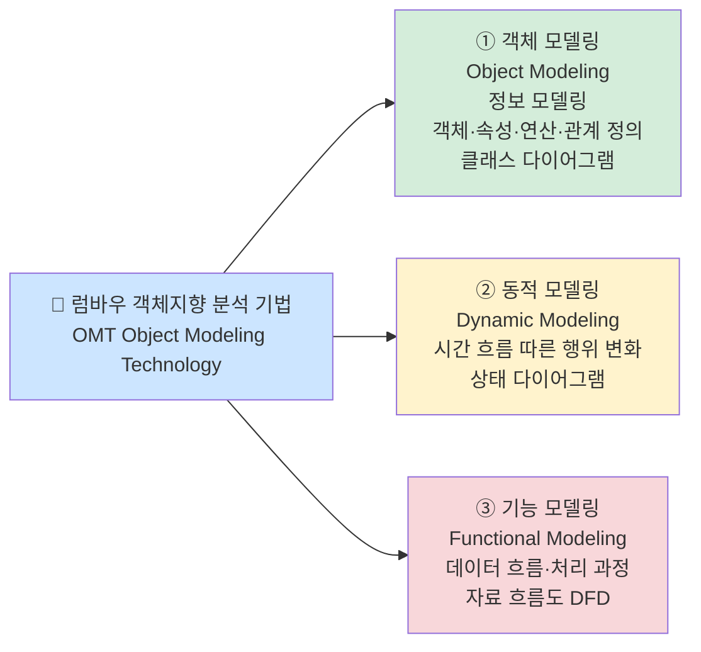

> 암기법: **객동기** (객체→동적→기능 순서)

---

## 4장: SOLID 원칙 ★A

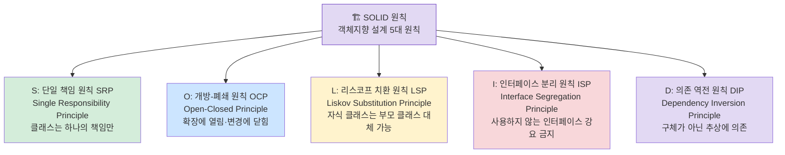

---

## 4장: 팬인 / 팬아웃 ★A

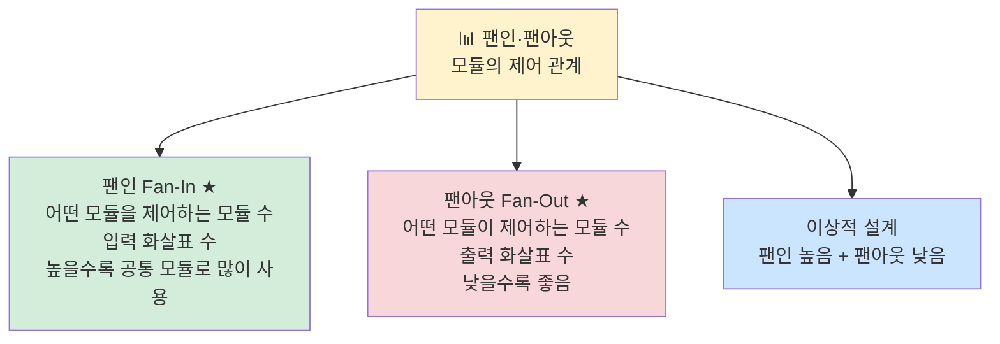

---

## 4장: IPC (프로세스 간 통신) ★A

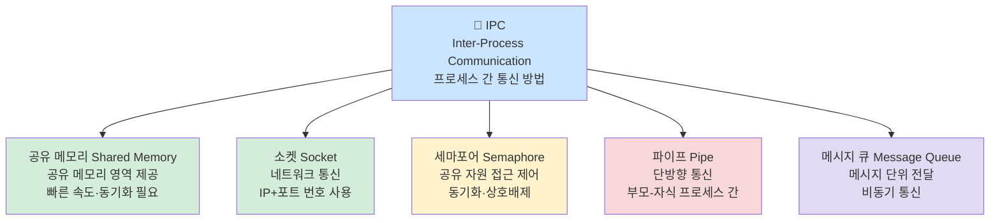

---

## 4장: 재사용 (Reuse) ★A

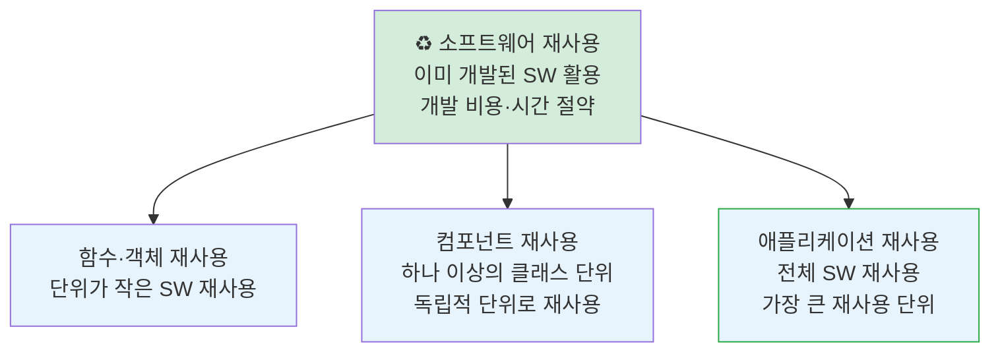

---

## 4장: 코드의 종류 ★B

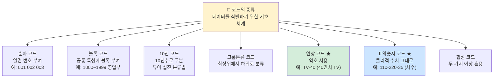

> 암기법: **순블10그연표합**

---

## 핵심 암기 요약표

| 번호 | 항목 | 핵심 키워드 | 난이도 |
|------|------|-------------|--------|
| 086 | XML | 다목적 마크업, 사용자 태그 정의, 트리 구조 | **A** |
| 087 | SOAP | HTTP·HTTPS 기반 XML 메시지 교환 | **A** |
| 088 | WSDL | 웹 서비스 인터페이스 정의(XML 기반) | **A** |
| 089 | 모듈화 | 결합도 최소화 + 응집도 최대화 | **A** |
| 089 | EAI 연계 방식 4가지 | P2P·Hub&Spoke·Message Bus·Hybrid | **A** |
| 093 | 파이프-필터 패턴 | UNIX 쉘, 데이터 스트림 처리 | **B** |
| 094 | 기타 아키텍처 패턴 | 브로커·P2P·이벤트버스·블랙보드 | **B** |
| 095 | 클래스 | 공통 속성+연산을 갖는 객체 집합 | **B** |
| 096 | 메시지 | 객체 간 상호작용 수단, 메서드 호출 | **B** |
| 097 | 캡슐화 | 외부 접근 제한·정보 은닉 | **B** |
| 100 | 럼바우 분석 기법 | 객체→동적→기능 모델링 (OMT) | **A** |
| 101 | SOLID 원칙 | SRP·OCP·LSP·ISP·DIP | **A** |
| 102 | 결합도 최악 | 내용 결합도 (다른 모듈 내부 직접 참조) | **A** |
| 103 | 결합도 최선 | 자료 결합도 (값만 전달) | **A** |
| 104 | 응집도 최선 | 기능적 응집도 (단일 기능) | **A** |
| 105 | 응집도 최악 | 우연적 응집도 (아무 관련 없음) | **A** |
| 106 | 결합도 암기순서 | 내공외제스자 (나쁨→좋음) | **A** |
| 107 | 팬인/팬아웃 | 팬인=제어하는 모듈 수, 팬아웃=제어받는 수 | **A** |
| 108 | 응집도 암기순서 | 기순교절시논우 (좋음→나쁨) | **A** |
| 109 | IPC | 공유메모리·소켓·세마포어·파이프·메시지큐 | **A** |
| 111 | 재사용 | 함수객체·컴포넌트·애플리케이션 (규모 순) | **A** |
| 112 | 코드의 종류 | 순블10그연표합 | **B** |
| 113 | Singleton | 인스턴스 1개, 전역 접근 | **A** |
| 114 | Factory Method | 하위 클래스가 객체 생성 결정 | **A** |
| 115 | Adapter | 호환되지 않는 인터페이스 연결 | **A** |
| 116 | Observer | 상태 변화 자동 통보 | **A** |
| 116 | Strategy | 알고리즘 교체 가능하게 캡슐화 | **A** |

---

*3장 통합 구현 + 4장 서버 프로그램 구현 (실기_이론(1) p.4~5 기반)*
