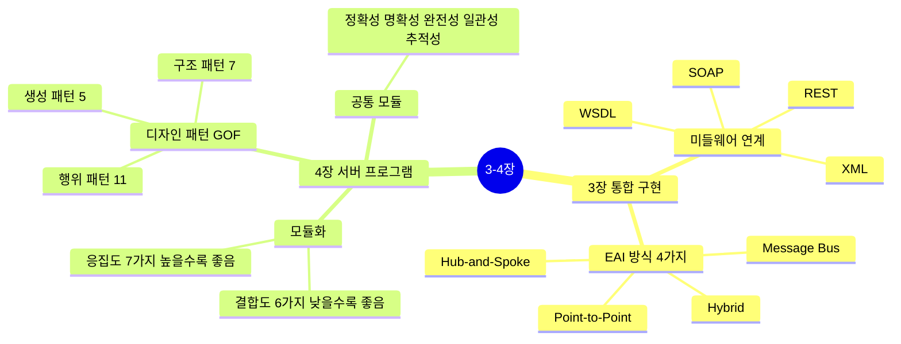
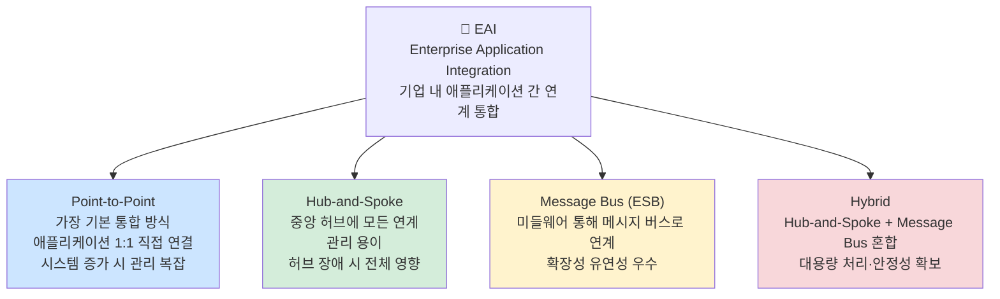
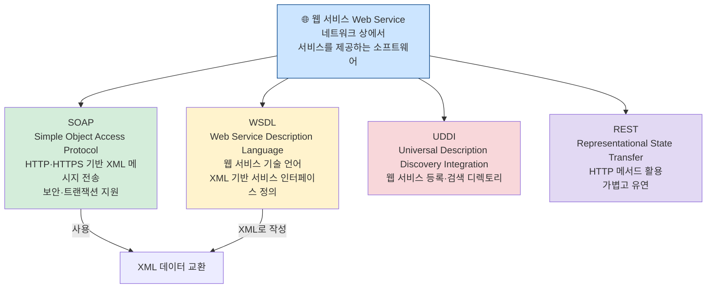
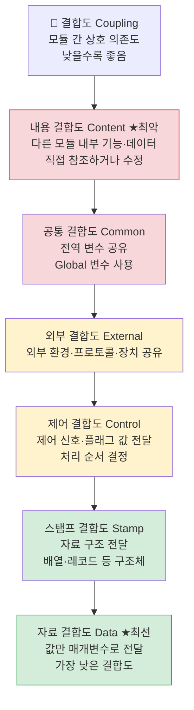
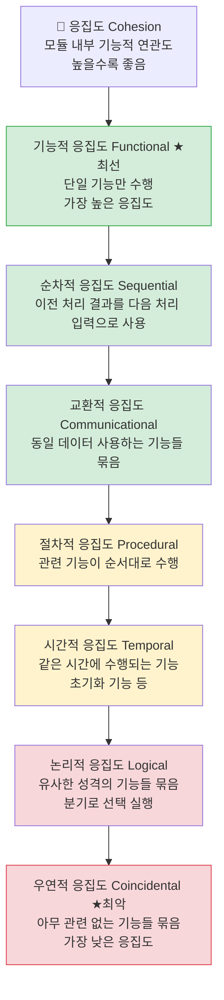
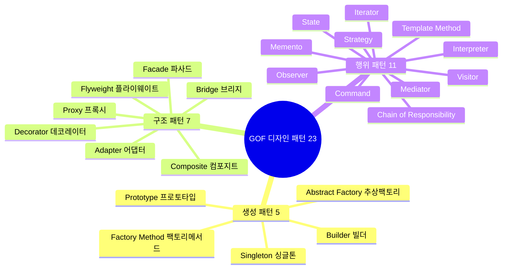
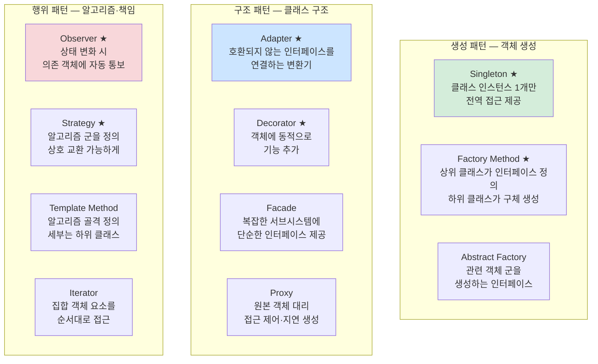

# 3-4장 통합 구현 + 서버 프로그램 구현 — 다이어그램 학습

---

## 전체 구조 마인드맵

---

## 3장: EAI 연계 방식 4가지 ★A

---

## 3장: 웹 서비스 기술 스택 ★B

---

## 4장: 결합도(Coupling) 6가지 ★A — 낮을수록 좋음

> 암기법: **내공외제스자** (내→공→외→제어→스탬프→자료, 나쁨→좋음)

---

## 4장: 응집도(Cohesion) 7가지 ★A — 높을수록 좋음

> 암기법: **기순교절시논우** (좋음→나쁨)

---

## 4장: GOF 디자인 패턴 23가지 ★A

---

## 4장: 주요 디자인 패턴 정리 ★A

---

## 핵심 암기 요약표

| 번호 | 항목 | 핵심 키워드 | 난이도 |
|------|------|-------------|--------|
| 054 | EAI 연계 방식 4가지 | P2P·Hub&Spoke·Message Bus·Hybrid | **A** |
| 055 | SOAP | HTTP·HTTPS 기반 XML 메시지 교환 | **B** |
| 056 | WSDL | 웹 서비스 인터페이스 정의(XML 기반) | **B** |
| 057 | REST | HTTP 메서드 기반, 경량 아키텍처 | **B** |
| 060 | 결합도 최악 | 내용 결합도 (다른 모듈 내부 직접 참조) | **A** |
| 061 | 결합도 최선 | 자료 결합도 (값만 전달) | **A** |
| 062 | 응집도 최선 | 기능적 응집도 (단일 기능) | **A** |
| 063 | 응집도 최악 | 우연적 응집도 (아무 관련 없음) | **A** |
| 064 | 결합도 암기순서 | 내공외제스자 (나쁨→좋음) | **A** |
| 065 | 응집도 암기순서 | 기순교절시논우 (좋음→나쁨) | **A** |
| 070 | Singleton | 인스턴스 1개, 전역 접근 | **A** |
| 071 | Factory Method | 하위 클래스가 객체 생성 결정 | **A** |
| 072 | Adapter | 호환되지 않는 인터페이스 연결 | **A** |
| 073 | Observer | 상태 변화 자동 통보 | **A** |
| 074 | Strategy | 알고리즘 교체 가능하게 캡슐화 | **A** |

---

*3장 통합 구현 + 4장 서버 프로그램 구현 (실기_이론(1) p.4~5 기반)*
