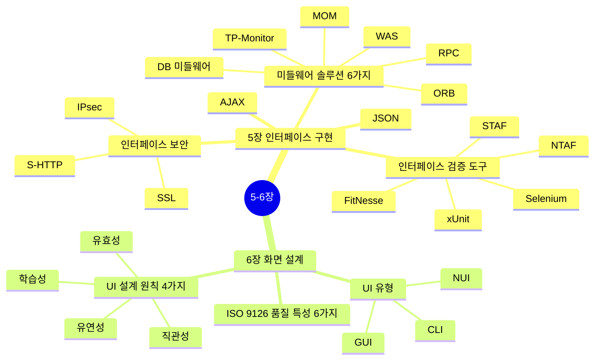
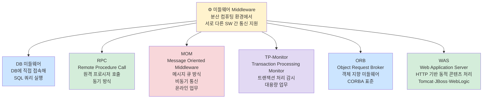
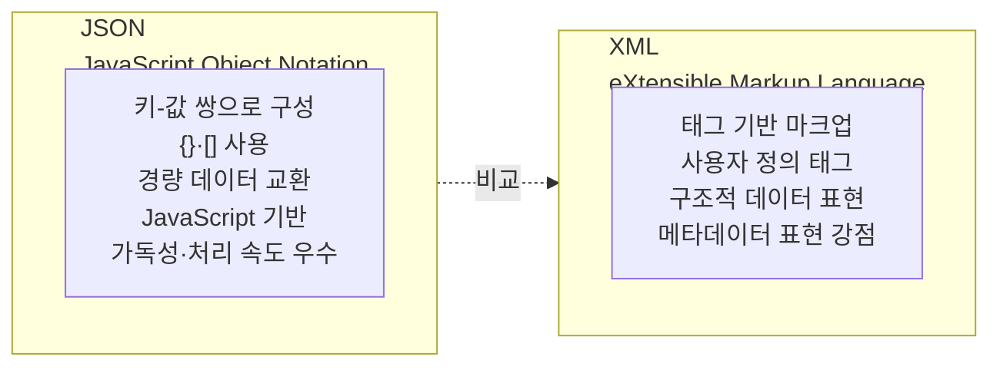
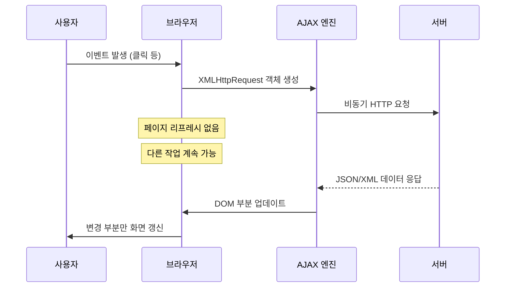
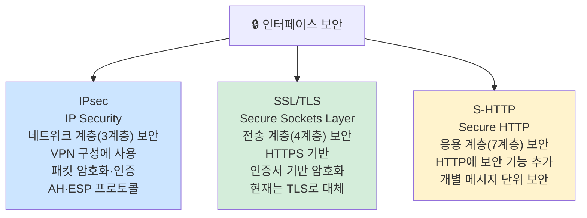
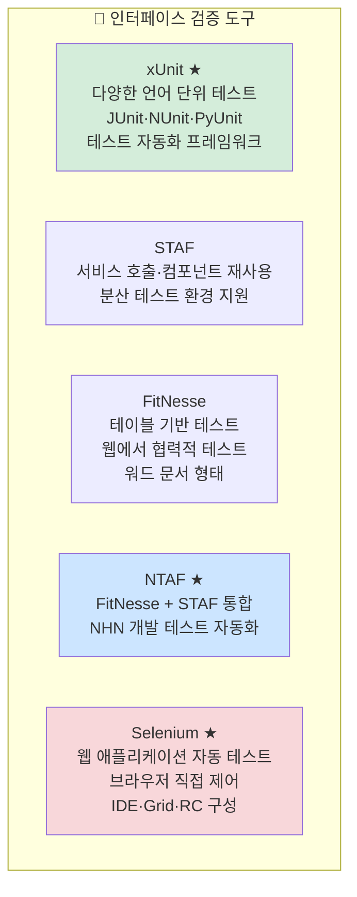
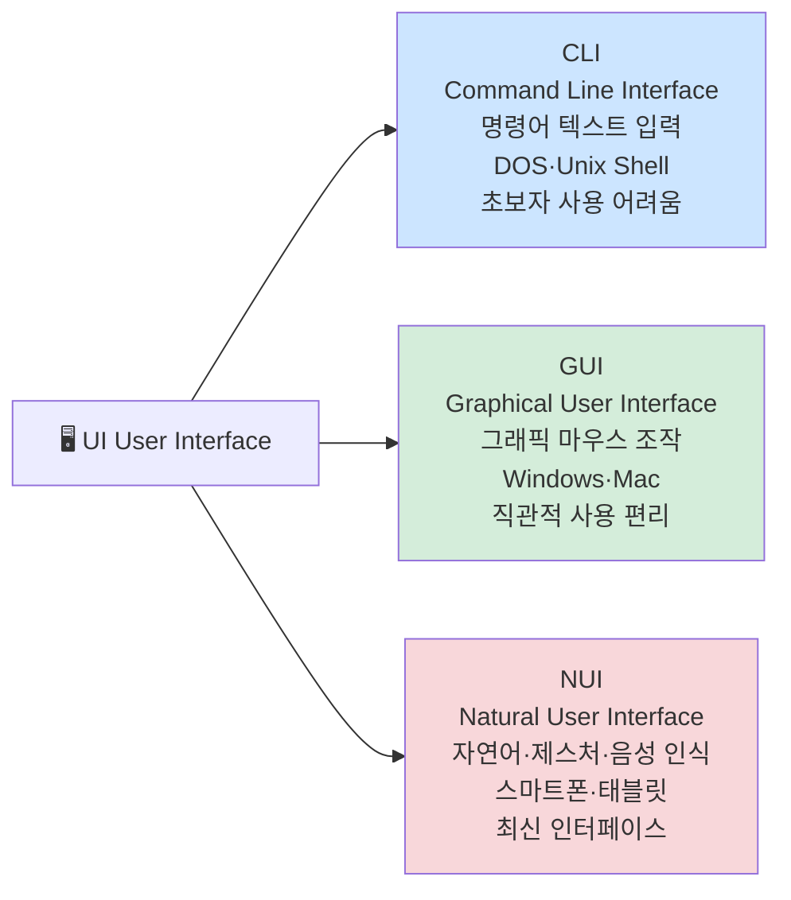
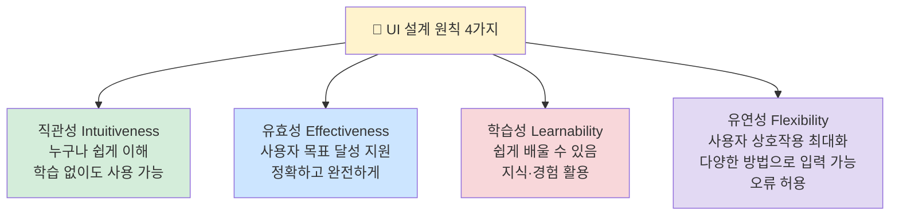
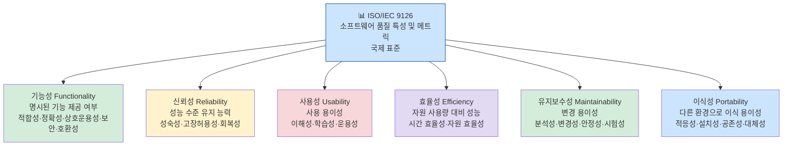

# 5-6장 인터페이스 구현 + 화면 설계 — 다이어그램 학습

---

## 전체 구조 마인드맵



---

## 5장: 미들웨어 솔루션 6가지 ★B



---

## 5장: JSON vs XML 비교 ★B



```
JSON 예시:
{"name": "홍길동", "age": 25, "skills": ["Java", "Python"]}

XML 예시:
<person>
  <name>홍길동</name>
  <age>25</age>
</person>
```

---

## 5장: AJAX 동작 흐름 ★B



> **AJAX** = Asynchronous JavaScript And XML
> 비동기 방식으로 서버와 데이터 교환, 전체 페이지 리로드 없이 부분 업데이트

---

## 5장: 인터페이스 보안 3가지 ★B



---

## 5장: 인터페이스 검증 도구 ★B



---

## 6장: UI 유형 3가지 ★B



---

## 6장: UI 설계 원칙 4가지 ★A



> 암기법: **직유학유** (직관성·유효성·학습성·유연성)

---

## 6장: ISO/IEC 9126 품질 특성 6가지 ★A



> 암기법: **기신사효유이** (기능성·신뢰성·사용성·효율성·유지보수성·이식성)

---

## 핵심 암기 요약표

| 번호 | 항목 | 핵심 키워드 | 난이도 |
|------|------|-------------|--------|
| 080 | MOM | 비동기 메시지 큐, 온라인 업무 | **B** |
| 081 | WAS | HTTP 기반 동적 콘텐츠, Tomcat | **B** |
| 082 | JSON | 키-값 쌍, 경량 데이터 교환 | **B** |
| 083 | AJAX | 비동기, 부분 업데이트, XHR | **B** |
| 084 | IPsec | 네트워크 계층, VPN, 패킷 암호화 | **B** |
| 085 | SSL/TLS | 전송 계층, HTTPS, 인증서 | **B** |
| 086 | S-HTTP | 응용 계층, 메시지 단위 보안 | **B** |
| 087 | xUnit | 단위 테스트 자동화 프레임워크 | **B** |
| 088 | Selenium | 웹 자동 테스트, 브라우저 제어 | **B** |
| 090 | CLI/GUI/NUI | 명령어/그래픽/자연어 인터페이스 | **B** |
| 091 | UI 설계 원칙 | 직관성·유효성·학습성·유연성 | **A** |
| 092 | ISO 9126 | 기능성·신뢰성·사용성·효율성·유지보수성·이식성 | **A** |

---

*5장 인터페이스 구현 + 6장 화면 설계 (실기_이론(1) p.6 기반)*
