# 7장 애플리케이션 테스트 관리 — 다이어그램 학습

---

## 전체 구조 마인드맵

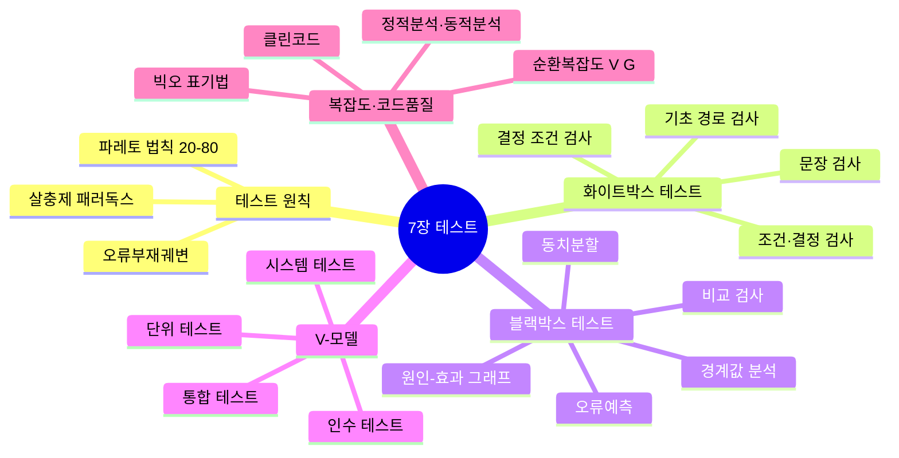

---

## 테스트 핵심 원칙 ★A

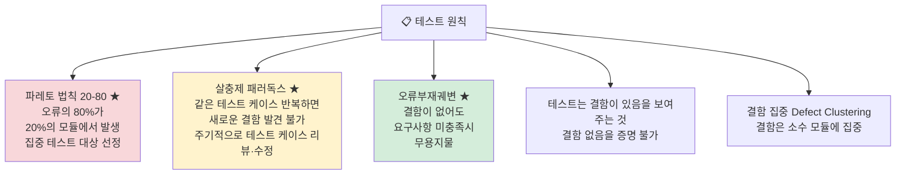

---

## 화이트박스 테스트 ★A

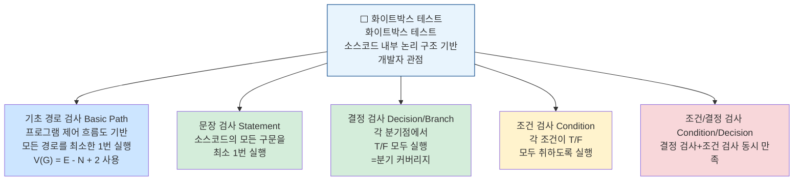

---

## 블랙박스 테스트 ★A

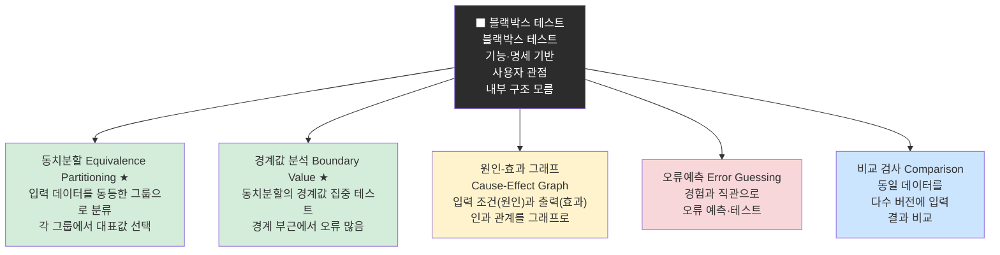

---

## V-모델 (개발-테스트 대응) ★A

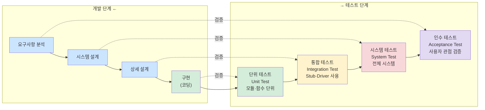

---

## 정적 테스트 vs 동적 테스트 ★A

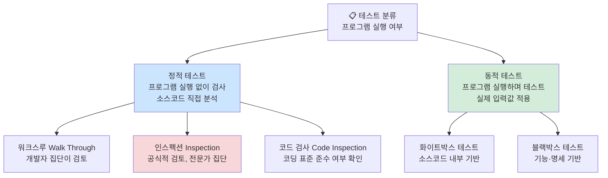

---

## 단위 / 통합 / 인수 테스트 상세 ★A

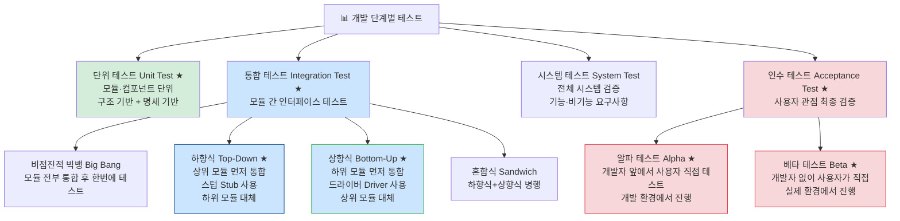

---

## 회귀 테스트 ★A

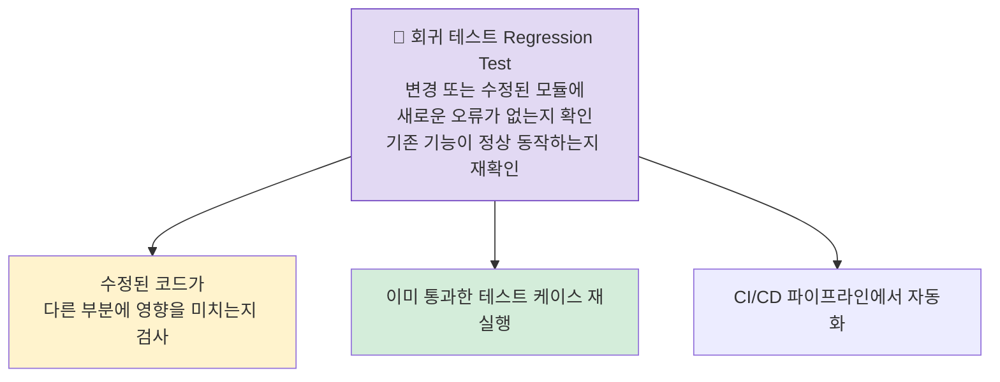

---

## 테스트 오라클의 종류 ★A

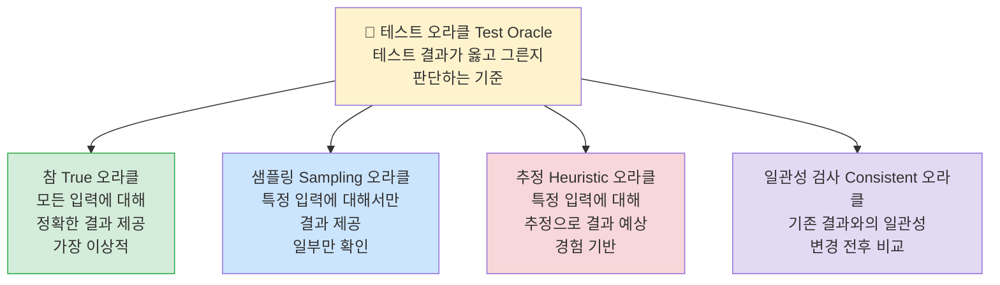

---

## 애플리케이션 성능 측정 지표 ★A

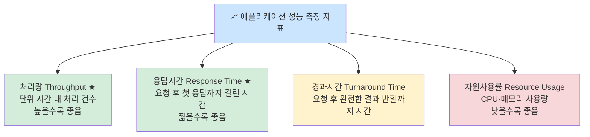

---

## 빅오 표기법 ★A

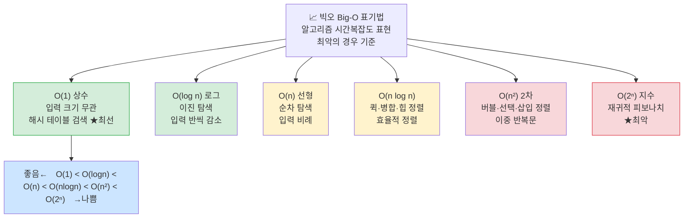

---

## 순환복잡도 V(G) ★A

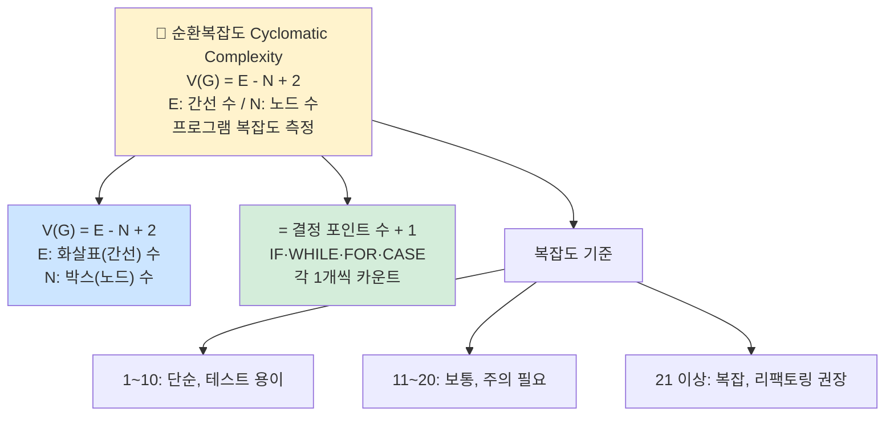

---

## 클린코드 5가지 원칙 ★B

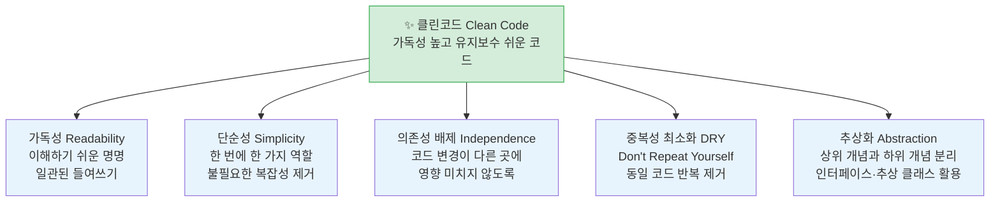

---

## 정적/동적 분석 도구 ★B

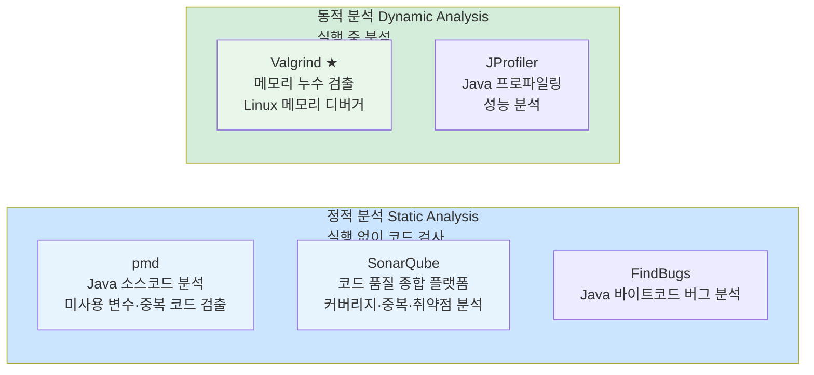

---

## 핵심 암기 요약표

| 번호 | 항목 | 핵심 키워드 | 난이도 |
|------|------|-------------|--------|
| 131 | 파레토 법칙 | 오류 80%가 20% 모듈에 집중 | **A** |
| 131 | 살충제 패러독스 | 같은 케이스 반복→새 결함 발견 불가 | **A** |
| 131 | 오류부재궤변 | 결함 없어도 요구사항 미충족이면 무용 | **A** |
| 132 | 정적 테스트 | 프로그램 실행 없이 검사 (워크스루·인스펙션) | **A** |
| 132 | 동적 테스트 | 프로그램 실행 후 검사 (화이트·블랙박스) | **A** |
| 133 | 화이트박스 | 내부 로직 기반, 개발자 관점 | **A** |
| 135 | 블랙박스 | 기능·명세 기반, 사용자 관점 | **A** |
| 136 | 동치분할 | 동등한 입력 그룹으로 분류, 대표값 | **A** |
| 136 | 경계값 분석 | 경계 부근 집중 테스트 | **A** |
| 137 | V-모델 순서 | 단위→통합→시스템→인수 | **A** |
| 138 | 단위 테스트 | 모듈·컴포넌트 단위, 구조기반+명세기반 | **A** |
| 139 | 빅뱅 통합 | 전부 통합 후 한번에 테스트 | **A** |
| 139 | 하향식 통합 | 상위→하위, 스텁(Stub) 사용 | **A** |
| 139 | 상향식 통합 | 하위→상위, 드라이버(Driver) 사용 | **A** |
| 140 | 알파 테스트 | 개발자 앞에서 사용자 직접 테스트 | **A** |
| 140 | 베타 테스트 | 개발자 없이 사용자가 실제 환경에서 | **A** |
| 141 | Stub | 하향식 통합 시 하위 모듈 대체 | **A** |
| 142 | Driver | 상향식 통합 시 상위 모듈 대체 | **A** |
| 143 | 회귀 테스트 | 변경 모듈에 새 오류 있는지 재확인 | **A** |
| 145 | 테스트 오라클 | 참·샘플링·추정·일관성검사 | **A** |
| 146 | 성능 측정 지표 | 처리량·응답시간·경과시간·자원사용률 | **A** |
| 147 | O(1) | 상수 시간, 최선 | **A** |
| 147 | V(G) 공식 | E - N + 2 (간선 - 노드 + 2) | **A** |
| 150 | 클린코드 | 가독성·단순성·의존성배제·중복최소화·추상화 | **B** |
| 151 | pmd/SonarQube | 정적 분석 도구 | **A** |
| 151 | Valgrind | 동적 분석, 메모리 누수 검출 | **A** |

---

*7장 애플리케이션 테스트 관리 (실기_이론(1) p.7 기반)*
