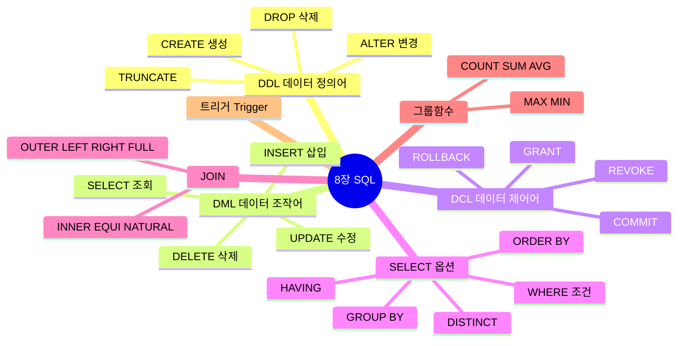
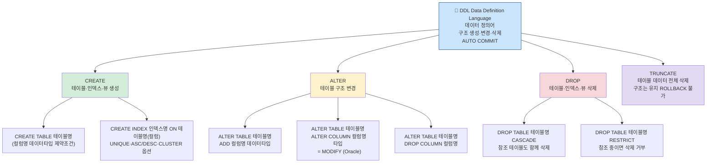
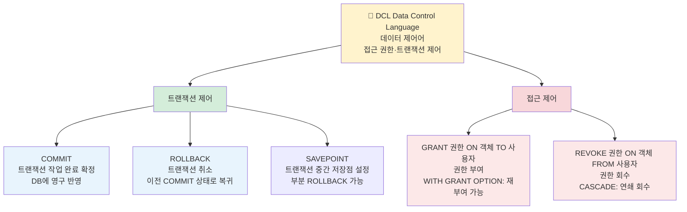
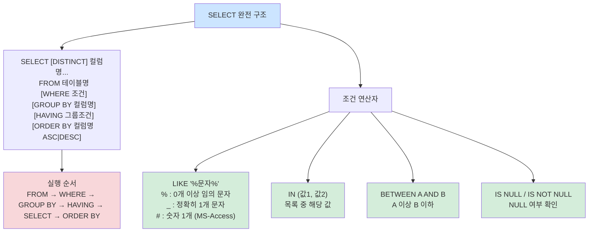
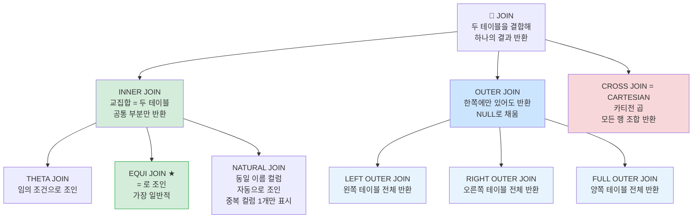
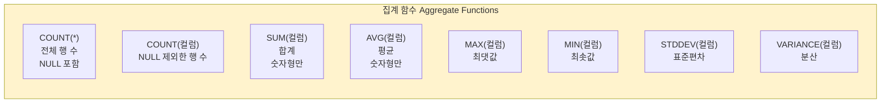
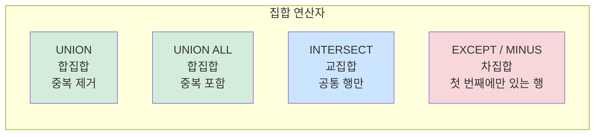
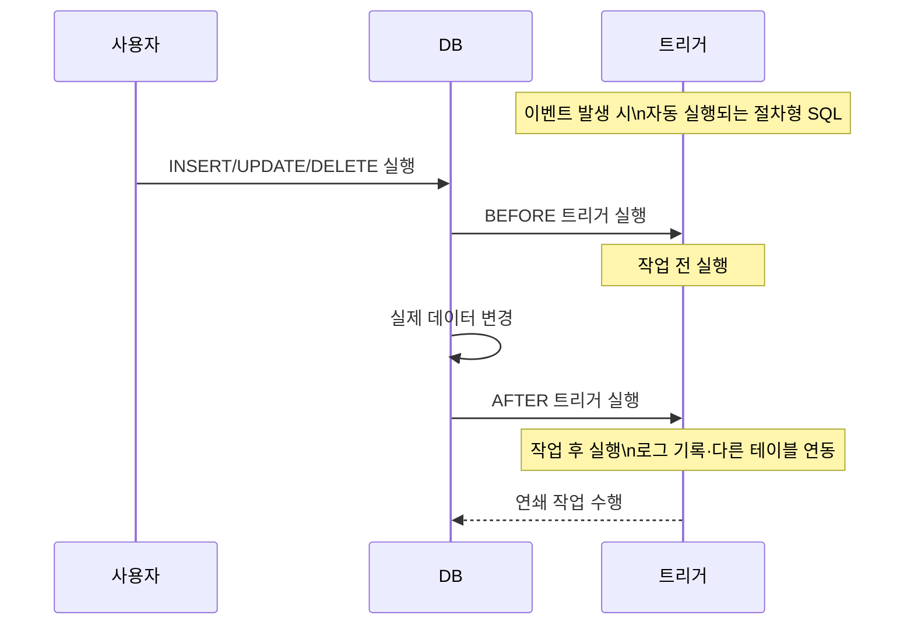
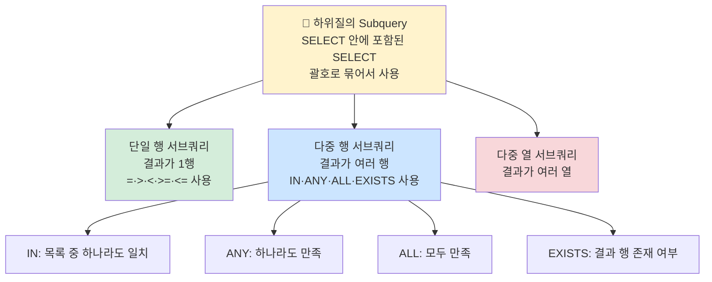

# 8장 SQL 응용 — 다이어그램 학습

---

## 전체 구조 마인드맵



---

## DDL 명령어 ★A



---

## DCL 명령어 ★A



---

## SELECT 문 완전 구조 ★A



---

## JOIN 종류 ★A



---

## 그룹 함수 ★A



```sql
-- 사용 예시
SELECT 부서, COUNT(*) AS 인원수, AVG(급여) AS 평균급여
FROM 사원
GROUP BY 부서
HAVING COUNT(*) >= 3
ORDER BY 평균급여 DESC;
```

---

## 집합 연산자 ★B



---

## 트리거(Trigger) ★A



```sql
-- 트리거 기본 구조
CREATE TRIGGER 트리거명
  AFTER INSERT ON 테이블명
  FOR EACH ROW
BEGIN
  -- 실행할 SQL
END;
```

---

## 하위질의(서브쿼리) ★A



---

## 핵심 암기 요약표

| 번호 | 항목 | 핵심 키워드 | 난이도 |
|------|------|-------------|--------|
| 120 | DDL 종류 | CREATE·ALTER·DROP·TRUNCATE (AUTO COMMIT) | **A** |
| 121 | DROP CASCADE vs RESTRICT | CASCADE=연쇄삭제 / RESTRICT=참조시거부 | **A** |
| 122 | COMMIT | 트랜잭션 완료 확정, 영구 반영 | **A** |
| 123 | ROLLBACK | 트랜잭션 취소, 이전 COMMIT 복귀 | **A** |
| 124 | GRANT | GRANT 권한 ON 객체 TO 사용자 | **A** |
| 125 | REVOKE | REVOKE 권한 ON 객체 FROM 사용자 | **A** |
| 126 | SELECT 실행 순서 | FROM→WHERE→GROUP BY→HAVING→SELECT→ORDER BY | **A** |
| 127 | LIKE % vs _ | %=0개이상 / _=정확히1개 | **A** |
| 128 | EQUI JOIN | = 연산자로 조인, 가장 일반적 | **A** |
| 129 | NATURAL JOIN | 같은 이름 컬럼 자동 조인, 중복 제거 | **B** |
| 130 | LEFT OUTER JOIN | 왼쪽 전체 + 오른쪽 NULL | **A** |
| 131 | COUNT(*) vs COUNT(컬럼) | *=NULL포함 / 컬럼=NULL제외 | **A** |
| 132 | UNION vs UNION ALL | UNION=중복제거 / UNION ALL=중복포함 | **A** |
| 133 | INTERSECT | 교집합, 두 테이블 공통 행 | **B** |
| 134 | 트리거 | 이벤트 발생 시 자동 실행 절차형 SQL | **A** |
| 135 | 서브쿼리 다중행 | IN·ANY·ALL·EXISTS | **B** |

---

*8장 SQL 응용 (실기_이론(1) p.8 기반)*
