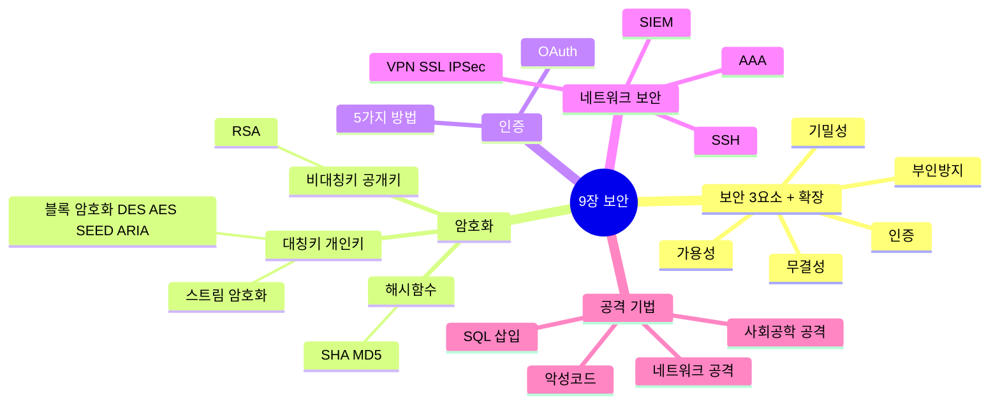
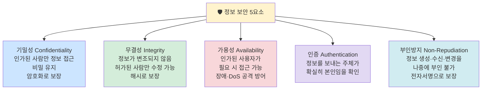
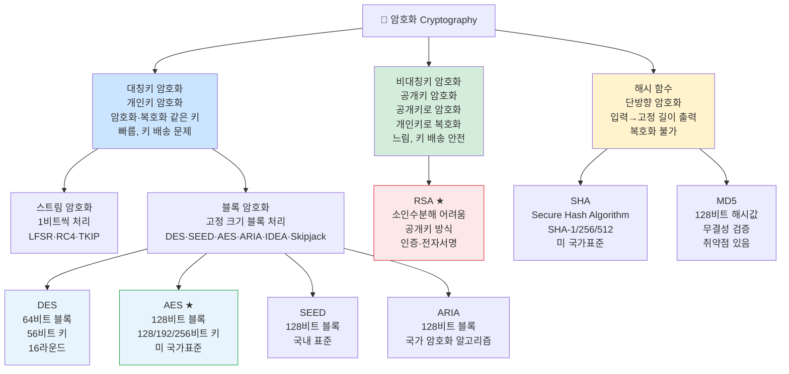
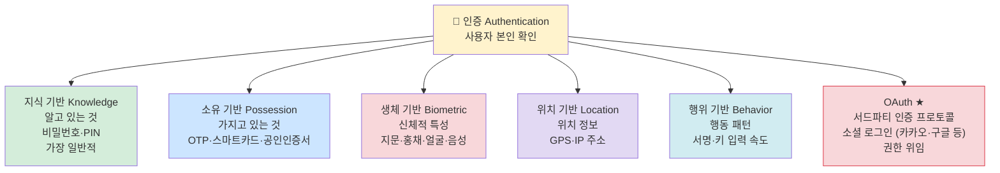
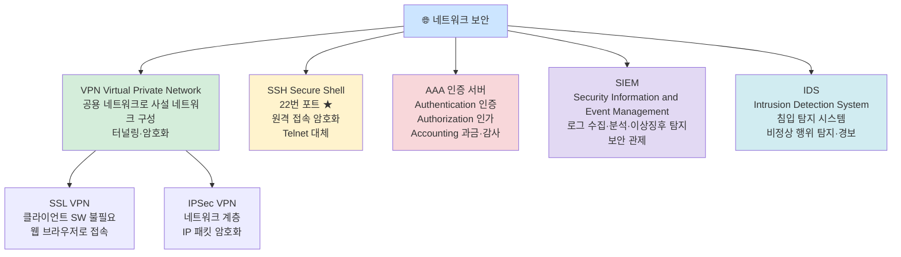
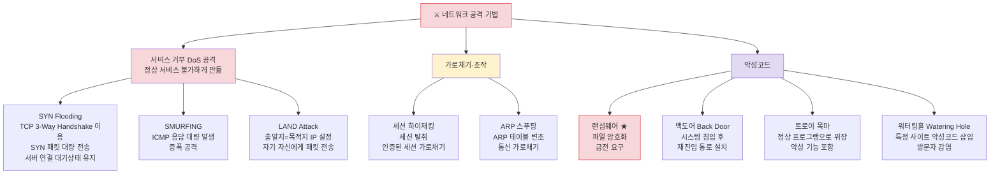
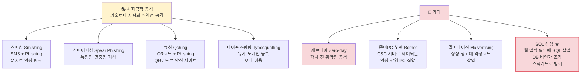

# 9장 소프트웨어 개발 보안 구축 — 다이어그램 학습

---

## 전체 구조 마인드맵

---

## 보안 5요소 ★A

---

## 암호화 분류 ★A

---

## 인증 방법 5가지 ★B

---

## 네트워크 보안 도구 ★B

---

## 네트워크 공격 기법 ★A

---

## 사회공학 공격 / 기타 공격 ★B

---

## 핵심 암기 요약표

| 번호 | 항목 | 핵심 키워드 | 난이도 |
|------|------|-------------|--------|
| 140 | 보안 3요소 | 기밀성·무결성·가용성 CIA | **A** |
| 141 | 부인방지 | 송수신 사실 부인 불가, 전자서명 | **A** |
| 142 | DES | 64비트 블록, 56비트 키, 16라운드 | **A** |
| 143 | AES | 128비트 블록, 미 국가표준 | **A** |
| 144 | RSA | 비대칭키, 소인수분해 기반 | **A** |
| 145 | SHA | 단방향 해시, 무결성 검증 | **A** |
| 146 | 인증 5가지 | 지식·소유·생체·위치·행위 | **B** |
| 147 | OAuth | 서드파티 인증, 소셜 로그인 | **B** |
| 148 | SSH 포트 | 22번 포트, Telnet 대체 | **A** |
| 149 | AAA | 인증·인가·과금 | **B** |
| 150 | SYN Flooding | TCP 핸드쉐이크 악용, DoS | **A** |
| 151 | LAND Attack | 출발지=목적지 IP | **B** |
| 152 | 세션 하이재킹 | 인증 세션 탈취 | **B** |
| 153 | ARP 스푸핑 | ARP 테이블 변조, 통신 가로채기 | **B** |
| 154 | 랜섬웨어 | 파일 암호화, 금전 요구 | **A** |
| 155 | SQL 삽입 | 웹 입력 필드에 SQL 삽입, 스택가드 방어 | **A** |
| 156 | 좀비PC·봇넷 | C&C 서버 제어, 악성 감염 PC 집합 | **B** |
| 157 | 제로데이 | 패치 미발표 취약점 공격 | **A** |
| 158 | 스미싱 | SMS + 피싱 | **B** |
| 159 | 타이포스쿼팅 | 유사 도메인, 오타 이용 | **B** |

---

*9장 소프트웨어 개발 보안 구축 (실기_이론(1) p.9~10 기반)*
