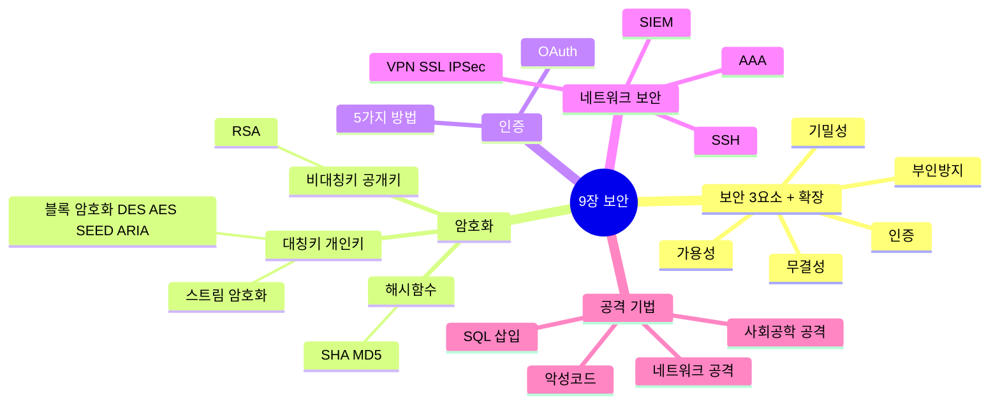
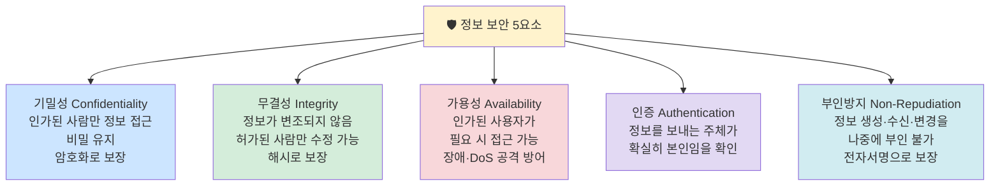
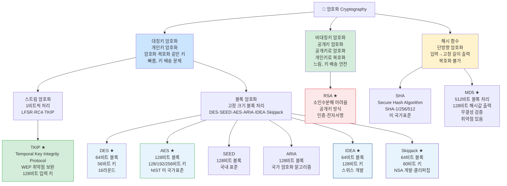
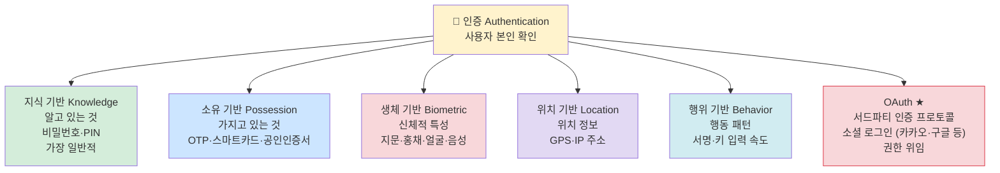
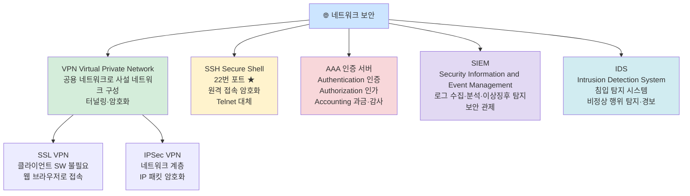
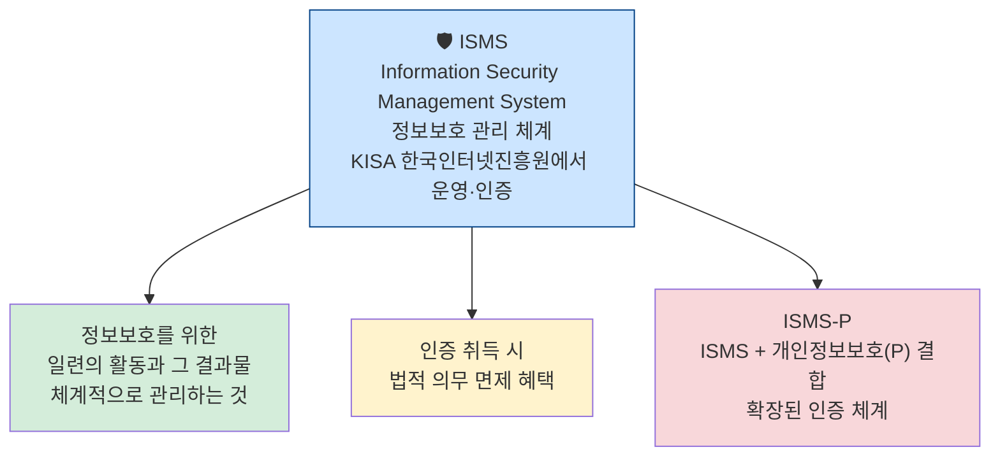
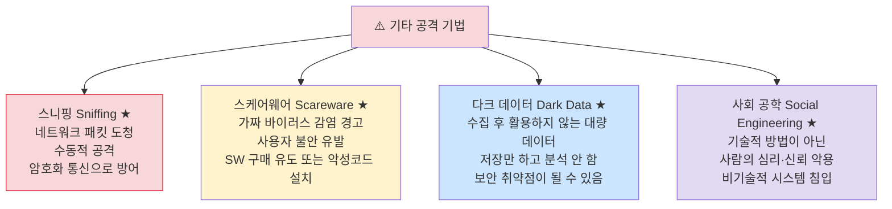
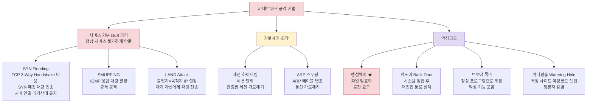
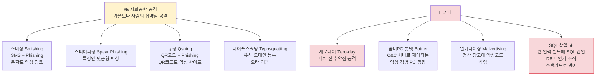

# 9장 소프트웨어 개발 보안 구축 — 다이어그램 학습

---

## 전체 구조 마인드맵

---

## 보안 5요소 ★A

---

## 암호화 분류 ★A

---

## 인증 방법 5가지 ★B

---

## 네트워크 보안 도구 ★B

---

## ISMS 정보보호 관리 체계 ★A

---

## 기타 주요 공격 기법 ★A

---

## 기타 보안 용어 ★A

```mermaid
graph TD
    TERM1["📖 기타 보안 용어 1"]

    TERM1 --> RK["루트킷 Rootkit\n시스템 최고 권한 취득 후\n자신을 숨기는 악성 소프트웨어"]
    TERM1 --> APT["APT Advanced Persistent Threat\n지능형 지속 공격\n특정 타깃 오랜 기간 공격"]
    TERM1 --> POD["Ping of Death\n과대 크기 ICMP 패킷 전송\n시스템 충돌 유발"]
    TERM1 --> QSH["큐싱 Qshing\nQR코드 + Phishing\nQR코드로 악성 사이트 유도"]
    TERM1 --> SMS["스미싱 Smishing\nSMS + Phishing\n문자 메시지로 악성 링크"]
    TERM1 --> SPH["스피어피싱 Spear Phishing\n특정인 맞춤형 피싱 공격"]

    style TERM1 fill:#fff3cd
    style APT fill:#f8d7da,stroke:#dc3545

    TERM2["📖 기타 보안 용어 2"]

    TERM2 --> ZOMB["좀비PC·봇넷 Botnet\nC&C 서버 제어를 받는\n악성 감염 PC 집합"]
    TERM2 --> ZD["제로데이 Zero-Day\n패치 미발표 취약점 공격"]
    TERM2 --> TROY["트로이 목마 Trojan Horse\n정상 프로그램으로 위장\n악성 기능 포함"]
    TERM2 --> CC["CC 인증\nCommon Criteria\nIT 보안 국제 표준"]
    TERM2 --> MALV["멀버타이징 Malvertising\n정상 광고에 악성코드 삽입"]
    TERM2 --> ISAC["ISAC\n정보공유·분석센터\n사이버 위협 정보 공유"]
    TERM2 --> VIR["바이러스 Virus\n다른 프로그램에 자신을 복사\n숙주 필요"]
    TERM2 --> WORM["웜 Worm\n독립 실행·자기 복제\n네트워크로 전파\n숙주 불필요"]

    style TERM2 fill:#f8d7da
    style ZD fill:#f8d7da,stroke:#dc3545
    style ZOMB fill:#f8d7da,stroke:#dc3545
```

---

## 네트워크 공격 기법 ★A

---

## 사회공학 공격 / 기타 공격 ★B

---

## 핵심 암기 요약표

| 번호 | 항목 | 핵심 키워드 | 난이도 |
|------|------|-------------|--------|
| 175 | 보안 5요소 | 기밀성·무결성·가용성·인증·부인방지 | **A** |
| 176 | SQL 삽입 | 동적쿼리 필터링, 스택가드로 방어 | **A** |
| 179 | 대칭키 스트림 | LFSR·RC4·TKIP | **A** |
| 179 | 대칭키 블록 | DES·SEED·AES·ARIA·IDEA·Skipjack | **A** |
| 180 | IDEA | 64비트 블록, 128비트 키, 스위스 개발 | **A** |
| 181 | Skipjack | 64비트 블록, 80비트 키, NSA·클리퍼칩 | **A** |
| 182 | DES | 64비트 블록, 56비트 키, 16라운드 | **A** |
| 183 | AES | 128비트 블록, 128/192/256키, NIST | **A** |
| 184 | RSA | 비대칭키, 소인수분해 기반 | **B** |
| 185 | TKIP | WEP 취약점 보완, 128비트 입력 키 | **A** |
| 186 | 해시 | 임의 길이→고정 길이, 단방향 | **A** |
| 187 | MD5 | 512비트 블록, 128비트 해시값 | **A** |
| 188 | 인증 5가지 | 지식·소유·생체·위치·행위 | **B** |
| 189 | OAuth | 서드파티 인증, 소셜 로그인 | **A** |
| 190 | VPN | SSL VPN·IPSec VPN | **A** |
| 191 | SIEM | 빅데이터 기반 보안 솔루션 | **A** |
| 192 | SSH | 22번 포트, 원격접속 암호화, Telnet 대체 | **A** |
| 193 | AAA | 인증·인가·과금 | **A** |
| 194 | ISMS | KISA 운영, 정보보호 관리 체계 인증 | **A** |
| 195 | SYN Flooding | TCP 3-Way-Handshake 악용, DoS | **A** |
| 196 | SMURFING | IP/ICMP 악용, 브로드캐스트 증폭 DoS | **A** |
| 197 | LAND Attack | 출발지=목적지 IP 설정 | **A** |
| 198 | 스케어웨어 | 가짜 바이러스 경고로 SW 구매 유도 | **A** |
| 199 | 세션 하이재킹 | TCP 시퀀스 번호 탈취 | **A** |
| 200 | ARP 스푸핑 | MAC 주소 변조, 통신 가로채기 | **A** |
| 201 | 사회 공학 | 비기술적 심리 악용, 시스템 침입 | **A** |
| 202 | 다크 데이터 | 수집 후 활용 안 되는 대량 데이터 | **A** |
| 203 | 타이포스쿼팅 | 유사 도메인, 오타 이용 = URL 하이재킹 | **A** |
| 204 | 스니핑 | 패킷 도청, 수동적 공격 | **A** |
| 205 | 워터링 홀 | 목표 방문 사이트 미리 감염 | **A** |
| 207 | 랜섬웨어 | 파일 암호화, 금전 요구 | **B** |
| 209 | 기타 용어1 | Rootkit·APT·Ping of Death·큐싱·스미싱·스피어피싱 | **A** |
| 210 | 기타 용어2 | 좀비PC·봇넷·제로데이·트로이목마·멀버타이징·ISAC·바이러스·웜 | **A** |

---

*9장 소프트웨어 개발 보안 구축 (실기_이론(1) p.9~10 기반)*
